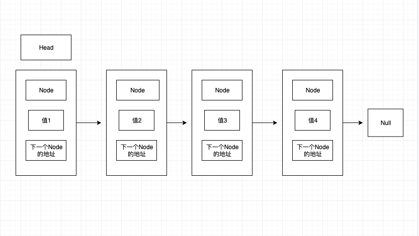

# [每日一题]面试官问：Async/Await 如何通过同步的方式实现异步？

关注「松宝写代码」，精选好文，每日一题

​时间永远是自己的

每分每秒也都是为自己的将来铺垫和增值

>作者：saucxs ｜ songEagle


## 一、前言

2020.12.23 日刚立的 flag，每日一题，题目类型不限制，可以是：算法题，面试题，阐述题等等。

本文是「每日一题」第 6 题：面试官问：Async/Await 如何通过同步的方式实现异步？


往期「每日一题」：

+ 第 5 道[「每日一题」到底该如何回答：vue数据绑定的实现原理？](https://mp.weixin.qq.com/s/8eo4frdB-zMA7nD_1wdnLw)

+ 第 4 道[「每日一题」与面试官手撕代码：如何科学高效的寻找重复元素？](https://mp.weixin.qq.com/s/jFZ_2f272LhBBPuuLaWnyg)

+ 第 3 道[「「每日一题」面试官问你对 Promise 的理解？可能是需要你能手动实现各个特性」](https://mp.weixin.qq.com/s/QuuPd2KCp50snN7F2o3oYg)

+ 第 2 道[「[每日一题]ES6 中为什么要使用 Symbol？」](https://mp.weixin.qq.com/s/omeVJdtabo5MeN3DItDfWg)

+ 第 1 道[「一道面试题是如何引发深层次的灵魂拷问？」](https://mp.weixin.qq.com/s/O8j9gM5tD5rjLz1kdda3LA)


## 二、Async/Await 如何通过同步的方式实现异步？
这个题目本身不是特别难，只能说是作为社招的基础面试题，但是如果想回答好这道题也不是很容易。

不信接着往下看：

### 1、概括的说

一个函数如果加上 async ，那么该函数就会返回一个 Promise。

await 只能在 async 函数中使用，可以把 async 看成将函数返回值使用 Promise.resolve() 包裹了下。

async 和 await 相比直接使用 Promise 来说，优势在于处理 then 的调用链，能够更清晰准确的写出代码。缺点在于滥用 await 可能会导致性能问题，因为 await 会阻塞代码，也许之后的异步代码并不依赖于前者，但仍然需要等待前者完成，导致代码失去了并发性。

我们来看一下代码实例：

```
async function test() {
  return "1";
}
console.log(test()); // -> Promise {<resolved>: "1"}
```

我们再来看一下这个实例：

```
function sleep() {
  return new Promise(resolve => {
    setTimeout(() => {
      console.log('finish')
      resolve("sleep");
    }, 2000);
  });
}
async function test() {
  let value = await sleep();
  console.log("object");
}
test()
```

上面代码会先打印 finish 然后再打印 object 。因为 await 会等待 sleep 函数 resolve ，所以即使后面是同步代码，也不会先去执行同步代码再来执行异步代码。


### 2、亮点回答

首先，js 是单线程的（重复三遍），所谓单线程，

意思就是说：执行代码是一行一行的往下走（即所谓的同步），

如果上面的没执行完，那就只能等着。

还是举个例子：

```
function test() {
  let d = Date.now();
  for (let i = 0; i < 1e8; i++) {}
  console.log(Date.now() - d); // 62ms左右
}
function test1() {
  let d = Date.now();

  console.log(Date.now() - d); // 0
}
test();
test1();
```

上面仅仅是一个 for 循环，而在实际应用中，会有大量的网络请求，它的响应时间是不确定的，这种情况下也要等待吗？

显然是不行的，因而 js 设计了异步，即 发起网络请求（诸如 IO 操作，定时器），由于需要等服务器响应，就先不理会，而是去做其他的事儿，等请求返回了结果的时候再说（即异步）。

那么如何实现异步呢？其实我们平时已经在大量使用了，那就是 callback，实现异步的核心就是回调钩子，将 cb 作为参数传递给异步执行函数，当有了结果后在触发 cb。想了解更多，可以去看看 event-loop 机制。

之前这种函数嵌套，大量的回调函数，使代码阅读起来晦涩难懂，不直观，形象的称之为回调地狱（callback hell），所以为了在写法上能更通俗一点，es6+陆续出现了 Promise、Generator、Async/await，力求在写法上简洁明了，可读性强。

async/await 是参照 Generator 封装的一套异步处理方案，可以理解为 Generator 的语法糖，

所以了解 async/await 就不得不讲一讲 Generator,以后我们可以讲一下这个。

而 Generator 又依赖于迭代器Iterator，以后我们可以讲一下这个。

终于找到源头了：单向链表，以后可以讲一下这个。


可以看到，async function 代替了 function*，await 代替了 yield，同时也无需自己手写一个自动执行器 run 了

现在再来看看async/await 的特点：

+ 当 await 后面跟的是 Promise 对象时，才会异步执行，其它类型的数据会同步执行
+ 返回的仍然是个 Promise 对象，上面代码中的 return 'done'; 会直接被下面 then 函数接收到


### 3、进阶回答
async/await 是参照 Generator 封装的一套异步处理方案，可以理解为 Generator 的语法糖，

所以了解 async/await 就不得不讲一讲 Generator,

而 Generator 又依赖于迭代器Iterator，

所以就得先讲一讲 Iterator,

而 Iterator 的思想呢又来源于单向链表，

终于找到源头了：单向链表

#### 3.1 什么是单向链表？

我们看一下wiki的说明：链表（Linked list）是一种常见的基础数据结构，是一种线性表，但是并不会按线性的顺序储存数据，而是在每一个节点里存到下一个节点的指针（Pointer）。由于不必须按顺序储存，链表在插入的时候可以达到 o(1)的复杂度，比另一种线性表顺序表快得多，但是查找一个节点或者访问特定编号的节点则需要 o(n)的时间，而顺序表响应的时间复杂度分别是 o(logn)和 o(1)。

总结一下链表优点：

+ 无需预先分配内存
+ 插入/删除节点不影响其他节点，效率高（典型的例子：git commit）

单向链表：是链表中最简单的一种，它包含两个域，一个信息域和一个指针域。这个链接指向列表中的下一个节点，而最后一个节点则指向一个空值。



一个单向链表包含两个值: 当前节点的值和一个指向下一个节点的链接

单链特点：节点的链接方向是单向的；相对于数组来说，单链表的的随机访问速度较慢，但是单链表删除/添加数据的效率很高。

理解 js 原型链/作用域链的话，理解这个很容易，他们是相通的。

#### 3.2 Iterator

Iterator 翻译过来就是**迭代器（遍历器）**让我们先来看看它的遍历过程(类似于单向链表)：

+ 创建一个指针对象，指向当前数据结构的起始位置:
+ 第一次调用指针对象的 next 方法，将指针指向数据结构的第一个成员
+ 第二次调用指针对象的 next 方法，将指针指向数据结构的第二个成员
+ 不断的调用指针对象的 next 方法，直到它指向数据结构的结束位置

一个对象要变成可迭代的，必须实现 @@iterator 方法，即对象（或它原型链上的某个对象）必须有一个名字是 Symbol.iterator 的属性（原生具有该属性的有：字符串、数组、类数组的对象、Set 和 Map）：

当一个对象需要被迭代的时候（比如开始用于一个 for..of 循环中），它的 @@iterator 方法被调用并且无参数，然后返回一个用于在迭代中获得值的迭代器

#### 3.3 Generator

Generator：生成器对象是生成器函数（GeneratorFunction）返回的，它符合可迭代协议和迭代器协议，既是迭代器也是可迭代对象，可以调用 next 方法，但它不是函数，更不是构造函数.

调用一个生成器函数并不会马上执行它里面的语句，而是返回一个这个生成器的迭代器对象，当这个迭代器的 next() 方法被首次（后续）调用时，其内的语句会执行到第一个（后续）出现 yield 的位置为止（让执行处于暂停状），yield 后紧跟迭代器要返回的值。或者如果用的是 yield*（多了个星号），则表示将执行权移交给另一个生成器函数（当前生成器暂停执行），调用 next() （再启动）方法时，如果传入了参数，那么这个参数会作为上一条执行的 yield 语句的返回值，

我们来总结一下 Generator 的本质，暂停，它会让程序执行到指定位置先暂停（yield），然后再启动（next），再暂停（yield），再启动（next），而这个暂停就很容易让它和异步操作产生联系，因为我们在处理异步时：开始异步处理（网络求情、IO 操作），然后暂停一下，等处理完了，再该干嘛干嘛。不过值得注意的是，js 是单线程的（又重复了三遍），异步还是异步，callback 还是 callback，不会因为 Generator 而有任何改变。

#### 3.4 Async/Await
async/await 是 Generator 的语法糖，就是一个自执行的generate函数。利用generate函数的特性把异步的代码写成“同步”的形式。

觉得这样是不是可以清晰点了。


## 各种福利


「松宝写代码」：开发知识体系构建，技术分享，项目实战，实验室，每日一题，带你一起学习新技术，总结学习过程，让你进阶到高级资深工程师，学习项目管理，思考职业发展，生活感悟，充实中成长起来。问题或建议，请公众号留言。


### 1、字节内推福利

回复「校招」获取内推码

回复「社招」获取内推

回复「实习生」获取内推

后续会有更多福利


### 2、学习资料福利
回复「算法」获取算法学习资料

### 3、每日一题
+ 本文是「每日一题」第 6 题：面试官问：Async/Await 如何通过同步的方式实现异步？

+ 第 5 题：[「每日一题」到底该如何回答：vue数据绑定的实现原理？](https://mp.weixin.qq.com/s/8eo4frdB-zMA7nD_1wdnLw)

+ 第 4 道[「每日一题」与面试官手撕代码：如何科学高效的寻找重复元素？](https://mp.weixin.qq.com/s/jFZ_2f272LhBBPuuLaWnyg)

+ 第 3 道[「「每日一题」面试官问你对 Promise 的理解？可能是需要你能手动实现各个特性」](https://mp.weixin.qq.com/s/QuuPd2KCp50snN7F2o3oYg)


+ 第 2 道[「[每日一题]ES6 中为什么要使用 Symbol？」](https://mp.weixin.qq.com/s/omeVJdtabo5MeN3DItDfWg)


+ 第 1 道[「一道面试题是如何引发深层次的灵魂拷问？」](https://mp.weixin.qq.com/s/O8j9gM5tD5rjLz1kdda3LA)


## The End
如果你觉得这篇文章对你有帮助，有启发，可能帮助到更多的人，我想请你帮我几个小忙：

1、点个「在看」，让更多的人也能看到这篇文章内容。

2、点个「赞」，是对文章的肯定。

3、点个「分享」到朋友圈，是为了让更多的人知道你在学习提升自己。

4、关注「松宝写代码」，后台回复「加群」 加入我们一起学习。