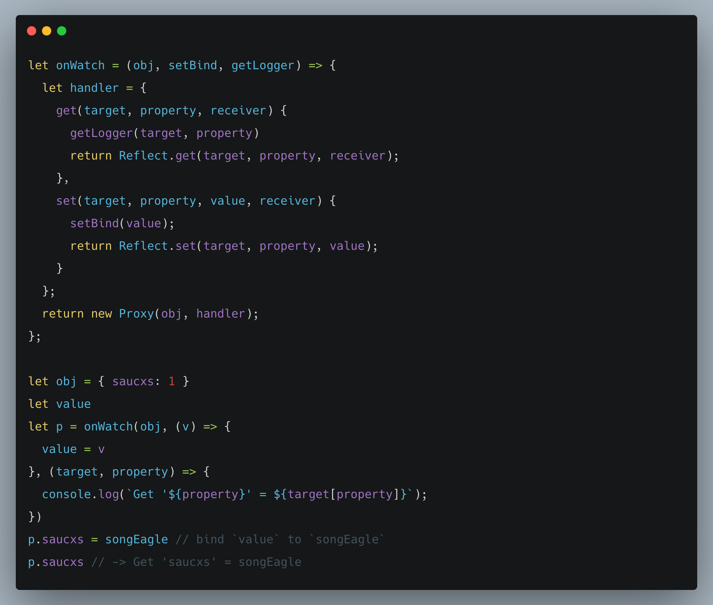

# 「每日一题」上次在dy面试，面试官问我：vue数据绑定的实现原理。你说我该如何回答？
关注公众号「松宝写代码」，精选好文，每日一题

加入我们一起学习，day day up

>作者：saucxs ｜ songEagle

>来源：原创


## 一、前言

2020.12.23 日刚立的 flag，每日一题，题目类型不限制，可以是：算法题，面试题，阐述题等等。

本文是「每日一题」第 5 题：上次在dy面试，面试官问我：vue数据绑定的实现原理。你说我该如何回答？


往期「每日一题」：

+ 第 4 道[「「每日一题」面试官问你对 Promise 的理解？可能是需要你能手动实现各个特性」](https://mp.weixin.qq.com/s/jFZ_2f272LhBBPuuLaWnyg)

+ 第 3 道[「「每日一题」面试官问你对 Promise 的理解？可能是需要你能手动实现各个特性」](https://mp.weixin.qq.com/s/QuuPd2KCp50snN7F2o3oYg)

https://mp.weixin.qq.com/s/QuuPd2KCp50snN7F2o3oYg

+ 第 2 道[「[每日一题]ES6 中为什么要使用 Symbol？」](https://mp.weixin.qq.com/s/omeVJdtabo5MeN3DItDfWg)

https://mp.weixin.qq.com/s/omeVJdtabo5MeN3DItDfWg

+ 第 1 道[「一道面试题是如何引发深层次的灵魂拷问？」](https://mp.weixin.qq.com/s/O8j9gM5tD5rjLz1kdda3LA)

## vue数据绑定的实现原理？
这个题目本身不是特别难，只能说是作为社招的基础面试题，但是如果想回答好这道题也不是很容易。

不信接着往下看

### 1、概括回答
vue.js是一个非常优秀的前端开发框架，使用vue的版本是v2.x

vue几个核心的地方：vue实例化，虚拟DOM，模板编译过程，数据绑定。

我们开始回到正题，vue.js的作者尤雨溪最初就是尝试实现一个类似angular1的东西，发现里面对于数据处理非常不优雅，于是创造性的尝试利用ES5中的Object.defineProperty来实现数据绑定，于是就有了最初的vue。

vue的数据绑定的实现原理离不开vue中响应式的数据处理方式。

我们可以回想一下官网的图：


vue的响应式基本原理：

+ 1、vue会遍历此data中对象所有的属性，

+ 2、并使用Object.defineProperty把这些属性全部转为getter/setter，

+ 3、而每个组件实例都有watcher对象，

+ 4、它会在组件渲染的过程中把属性记录为依赖，

+ 5、之后当依赖项的 setter被调用时，会通知watcher重新计算，从而致使它关联的组件得以更新。


### 2、亮点回答
概括回答我们只回答了使用ES5的方法 Object.defineProperty 实现数据的监听的，那么具体是如何实现还是没有讲的很清楚。

这时候我们需要问自己，如何找亮点？

vue的响应式原理设计三个重要对象：Observer，Watcher，Dep。

+ Observer对象：vue中的数据对象在初始化过程中转换为Observer对象。

+ Watcher对象：将模板和Observer对象结合在一起生成Watcher实例，Watcher是订阅者中的订阅者。

+ Dep对象：Watcher对象和Observer对象之间纽带，每一个Observer都有一个Dep实例，用来存储订阅者Watcher。

当属性变化会执行主题对象Observer的dep.notify方法， 这个方法会遍历订阅者Watcher列表向其发送消息， Watcher会执行run方法去更新视图。

依赖关系图如下，更能方面我们的理解


接着我们需要补充的是：模板编译过程中的指令和数据绑定都会生成Watcher实例，实例中的watch属性也会生成Watcher实例。

说的这些有没有觉得有点乱，那我们总结一下如何亮点回答

+ 1、在生命周期的initState方法中将data，prop，method，computed，watch中的数据劫持， 通过observe方法与Object.defineProperty方法将相关对象转为换Observer对象。
+ 2、然后在initRender方法中解析模板，通过Watcher对象，Dep对象与观察者模式将模板中的 指令与对象的数据建立依赖关系，使用全局对象Dep.target实现依赖收集。
+ 3、当数据变化时，setter被调用，触发Object.defineProperty方法中的dep.notify方法， 遍历该数据依赖列表，执行器update方法通知Watcher进行视图更新。
+ vue是无法检测到对象属性的添加和删除，但是可以使用全局Vue.set方法（或vm.$set实例方法）。
+ vue无法检测利用索引设置数组，但是可以使用全局Vue.set方法（或vm.$set实例方法）。
+ 无法检测直接修改数组长度，但是可以使用splice

然后写一个使用Object.defineProperty实现监听变量

```
var obj = {};
var a;
Object.defineProperty(obj, 'a', {
  get: function() {
    console.log('get val');　
    return a;
  },
  set: function(newVal) {
    console.log('set val:' + newVal);
    a = newVal;
  }
});
obj.a;     // get val 
obj.a = 'saucxs'    //set val
```

如果上面代码格式出现问题，可以查看下面代码图片


### 3、进阶回答

因为现在vue已经到3了，不再是停留在2的时候，这个时候，可以把3的原理简单说一下。

这个时候不应该是ES6的proxy特性上场了，proxy是ES6的新增的功能，可以用来定义对象中的操作。

```
let p = new Proxy(target, handler);
// `target` 代表需要添加代理的对象
// `handler` 用来自定义对象中的操作
```

如果上面代码格式出现问题，可以查看下面代码图片


可以很方便的使用 Proxy 来实现一个数据绑定和监听.

```
let onWatch = (obj, setBind, getLogger) => {
  let handler = {
    get(target, property, receiver) {
      getLogger(target, property)
      return Reflect.get(target, property, receiver);
    },
    set(target, property, value, receiver) {
      setBind(value);
      return Reflect.set(target, property, value);
    }
  };
  return new Proxy(obj, handler);
};

let obj = { saucxs: 1 }
let value
let p = onWatch(obj, (v) => {
  value = v
}, (target, property) => {
  console.log(`Get '${property}' = ${target[property]}`);
})
p.saucxs = songEagle // bind `value` to `songEagle`
p.saucxs // -> Get 'saucxs' = songEagle
```

如果上面代码格式出现问题，可以查看下面代码图片




然后在对比vue2和vue3的区别是什么？

以及为啥在数据监听上做了升级？

vue为什么对数组对象的深层监听无法实现，因为组件每次渲染都是将data里的数据通过defineProperty进行响应式或者双向绑定上，之前没有后加的属性是不会被绑定上，也就不会触发更新渲染。


区别：

1、语法层面上

+ defineProperty只能响应首次渲染时候的属性，
+ Proxy需要的是整体监听，不需要关心里面有什么属性，而且Proxy的配置项有13种，可以做更细致的事情，这是之前的defineProperty无法达到的。

2、兼容层面上

+ vue2.x之所以只能兼容到IE8就是因为defineProperty无法兼容IE8,其他浏览器也会存在轻微兼容问题。
+ proxy的话除了IE，其他浏览器都兼容，这次vue3还是使用了它，说明vue3直接放弃了IE的兼容考虑。


## 各种福利


「松宝写代码」：开发知识体系构建，技术分享，项目实战，实验室，每日一题，带你一起学习新技术，总结学习过程，让你进阶到高级资深工程师，学习项目管理，思考职业发展，生活感悟，充实中成长起来。问题或建议，请公众号留言。


### 1、字节内推福利

回复「校招」获取内推码

回复「社招」获取内推

回复「实习生」获取内推

后续会有更多福利


### 2、学习资料福利
回复「算法」获取算法学习资料

### 3、每日一题
+ 本文是「每日一题」第 5 题：上次在dy面试，面试官问我：vue数据绑定的实现原理。你说我该如何回答？

+ 第 4 道[「「每日一题」面试官问你对 Promise 的理解？可能是需要你能手动实现各个特性」](https://mp.weixin.qq.com/s/jFZ_2f272LhBBPuuLaWnyg)

+ 第 3 道[「「每日一题」面试官问你对 Promise 的理解？可能是需要你能手动实现各个特性」](https://mp.weixin.qq.com/s/QuuPd2KCp50snN7F2o3oYg)

https://mp.weixin.qq.com/s/QuuPd2KCp50snN7F2o3oYg

+ 第 2 道[「[每日一题]ES6 中为什么要使用 Symbol？」](https://mp.weixin.qq.com/s/omeVJdtabo5MeN3DItDfWg)

https://mp.weixin.qq.com/s/omeVJdtabo5MeN3DItDfWg

+ 第 1 道[「一道面试题是如何引发深层次的灵魂拷问？」](https://mp.weixin.qq.com/s/O8j9gM5tD5rjLz1kdda3LA)


## The End
如果你觉得这篇文章对你有帮助，有启发，可能帮助到更多的人，我想请你帮我几个小忙：

1、点个「在看」，让更多的人也能看到这篇文章内容。

2、点个「赞」，是对文章的肯定。

3、点个「分享」到朋友圈，是为了让更多的人知道你在学习提升自己。

4、关注「松宝写代码」，后台回复「加群」 加入我们一起学习。