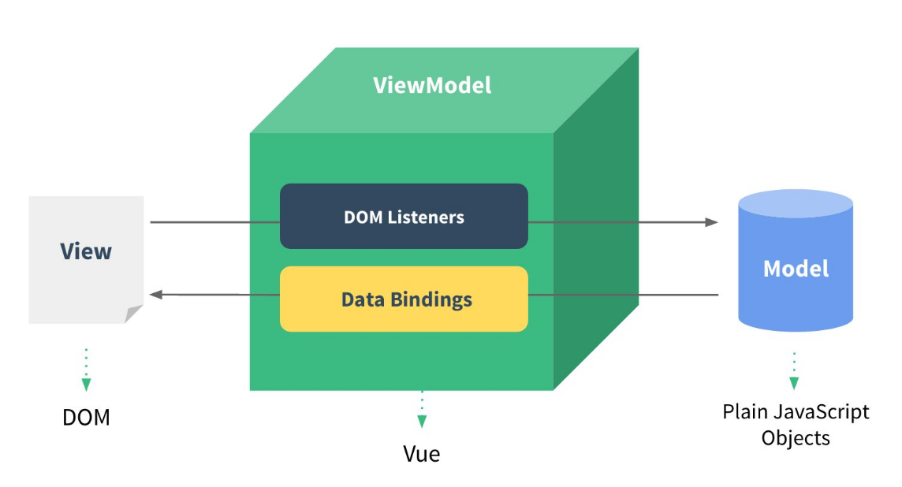
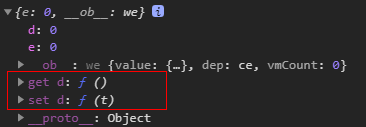
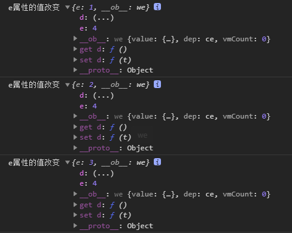
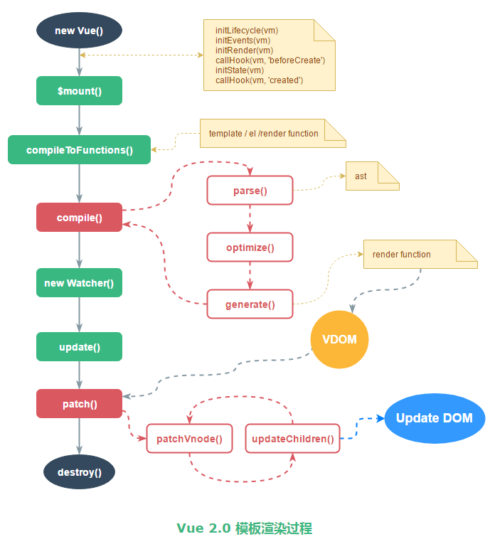
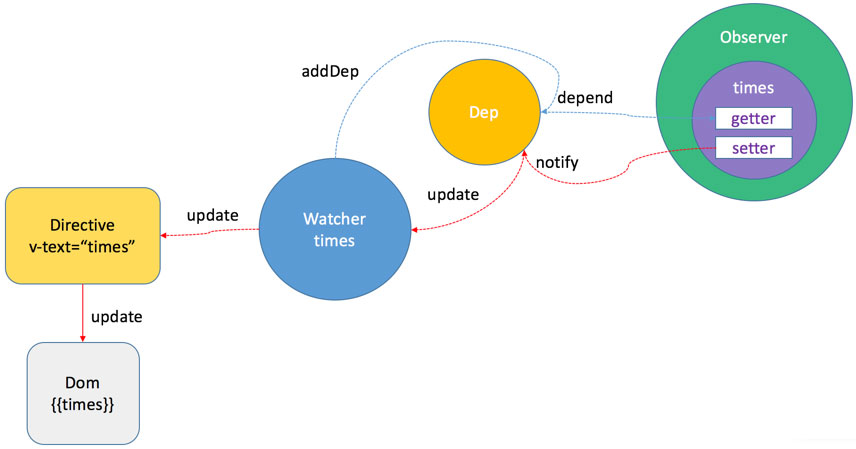

## 22、Vue
Vue框架的入口就是vue实例，其实是框架中的View Model ，他包含了页面中的业务处理逻辑，数据模型，生命周期中多个事件钩子。

Vue实例虽然没有完全遵循MVVM模型，但是收到MVVM的启发。



从图中知道：vue实际就是MVVM中的VM，就是ViewModel，所以看到文档中的vm这个变量其实就是Vue实例。
```js
let app = new Vue({
    el: '#app',
    data() {
        return {
            name: 'saucxs',
            count: 0
        }
    },
    method: {
        addNumber: function() {
          this.count++
        }
    }
})
```
上面代码中el: '#app'牵着View，data:{}牵着Model，而methods充当controller，可以修改Model的值。

### vue的style下scope
scoped实现样式私有化原理：vue通过DOM结构以及css样式上加唯一不重复标记，以保证唯一，达到样式私有化模块目的。

scope返回值是slot标签上返回的所有属性。

+ html的dom节点加了一个不重复**data属性**表示唯一性。
+ 每句css选择器的末尾加一个当前组件的**data属性选择器**来私有化样式。
+ 如果当前组件内部包含其他组件，只会给其他组件的最外层标签加上当前组件的data属性。

样式的权重加重了，理论上我们修改这个样式，需要更高权重去覆盖样式

### vue的插槽slot
vue的slot插槽可以传递任何属性或者html元素，scope="它可以取任意字符串"

插槽，也就是slot，组件的一块html模板，这块模板的显示不显示，由父组件决定。
最核心东西：显示和怎么显示。

模板分类：非插槽模板，插槽模板。

+ 单个插槽，一个组件中只能有一个该类插槽，
+ 具名插槽，一个组件内可以有多个，只要名字不同就可以。

**上面两种插槽不绑定数据，父组件提供模板包括样式和内容。**

父组件
```
<template>
  <div class="father">
    <h3>这里是父组件</h3>
    <child>
      <div class="tmpl" slot="up">
        <span>菜单1</span>
        <span>菜单2</span>
        <span>菜单3</span>
        <span>菜单4</span>
        <span>菜单5</span>
        <span>菜单6</span>
      </div>
      <div class="tmpl">
        <span>菜单->1</span>
        <span>菜单->2</span>
        <span>菜单->3</span>
        <span>菜单->4</span>
        <span>菜单->5</span>
        <span>菜单->6</span>
      </div>
    </child>
  </div>
</template>
```

子组件
```
<template>
  <div class="child">
   <h3>这里是子组件</h3>
   
    // 具名插槽
    <slot name="up"></slot>
    
    // 匿名插槽
    <slot></slot>
  </div>
</template>
```


插槽语法
```
匿名插槽
<slot></slot>
具名插槽
<slot name="up"></slot>
```

父组件通过html模板上的slot属性关联具名插槽。没有slot属性的html模板默认关联匿名插槽

+ 作用域插槽
**样式父组件说的算，内容由子组件插槽绑定的。**


### v-if和v-show区别
相同点：都是判断dom节点是否需要显示。


不同点：
+ 实现方式：v-if是从dom树上删除和重建节点；v-show是修改dom节点的display属性值。
+ 编译过程：v-if是局部编译和卸载，销毁和重建；v-show是简单css切换。
+ 编译条件：v-if是惰性的，条件为真的时候局部编译；v-show在首次时候都会编译，缓存，dom元素始终保留。
+ 性能消耗：v-if有更高的切换性能，不适合做频繁切换；v-show有更高的**初始渲染消耗**，适合做频繁切换。

### vue常用的修饰符
+ 按键修饰符：delete
```js
<input class = 'aaa' v-model="inputValue" @keyup.delete="onKey"/>
```
+ 系统修饰符：ctrl，alt，shift等
+ 鼠标按钮修饰符：left，right，middle
```js
<button @click.middle ="onClick">A</button>
```


### 22.1 全局API
#### 1、Vue.extend 扩展实例的构造器
Vue.extend(对象)返回的是一个**扩展实例的构造器**。作用：服务于Vue.component，用来生成组件。
可以理解成：
> 在模板中遇到该组件名称作为自定义的元素标签时，会自动调用扩展实例构造器来生产组件实例，并挂载到自定元素上。
+ data 选项是特例，需要注意 - 在 Vue.extend() 中data必须是函数
```html
<div id="mount-place"></div>
```
```js
var ExtendPlace = Vue.extend({
    template: '<p>welcome {{firstName}} {{lastName}} to {{place}}</p>',
    data: function() {
      return {
          firstName: 'Cheng',
          lastName: 'Xinsong',
          place: 'sau交流学习社区'
      }
    }
})
// 创建ExtendPlace实例，并挂载到一个元素上，不挂载没有效果
new ExtendPlace().$mount('#mount-place')   // 用自定义标签<extendplace></extendplace>的使用：  new Profile().$mount('extendplace')
```
运行结果：<p>welcome Cheng Xinsong to sau交流学习社区</p>

注意：还有一种写法
```html
<div id="mount-place">
    <mountplace></mountplace>
</div>
```
```js
var ExtendPlace = Vue.extend({
    template: '<p>welcome {{firstName}} {{lastName}} to {{place}}</p>',
    data(){
        return {
           firstName: 'Cheng',
           lastName: 'Xinsong',
           place: 'sau交流学习社区'
        }
    }
})
Vue.component('mountplace', ExtendPlace);
var vm = new Vue({
    el: '#mount-place'
})
```


（1）使用propsData
```js
var ExtendPlace = Vue.extend({
    template: '<p>welcome {{firstName}} {{lastName}} to {{place}}</p>',
    data: function() {
      return{
        firstName: 'Cheng',
        lastName: 'Xinsong',
      }
    },
    props : ['place']
})
new ExtendPlace({
    propsData: {
       place: 'sau交流学习社区'
    }
}).$mount('#mount-place')
```
运行结果：<p>welcome Cheng Xinsong to sau交流学习社区</p>

综上所述：extend创建的是Vue构造器，并不是我们平时写的组件实例，所以不可以直接new Vue({component: ExtendPlace})直接使用，
需要使用new ExtendPlace().$mount('#mount-place')指定挂载元素。

为什么要使用extend？
vue中页面基本上，可以使用import来进行组件的局部注册，但是import注册的组件有缺点：
+ （1）组件模板都是提前定义好的，如果接口动态渲染组件怎么处理。
+ （2）如何实现一个全局调用组件

#### 2、Vue.nextTick DOM的异步更新
下次更新DOM更新循环结束之后执行延迟回调，在修改数据之后立即使用这个方法，获取**更新后的DOM**。
我们看个栗子
```html
  <div class="app">
        <div ref="msgDiv">{{msg}}</div>
        <div v-if="msg1">outside $nextTick: {{msg1}}</div>
        <div v-if="msg2">inside $nextTick: {{msg2}}</div>
        <div v-if="msg3">outside $nextTick: {{msg3}}</div>
        <button @click="changeMsg">改变</button>
  </div>
```
```js
 new Vue({
        el: '.app',
        data: {
            msg: 'Hello Vue.',
            msg1: '',
            msg2: '',
            msg3: ''
        },
        methods: {
            changeMsg() {
                this.msg = "Hello world."
                this.msg1 = this.$refs.msgDiv.innerHTML
                this.$nextTick(() => {
                    this.msg2 = this.$refs.msgDiv.innerHTML
                })
                this.msg3 = this.$refs.msgDiv.innerHTML
            }
        }
    })
```


##### 应用场景
+ Vue生命周期的created()钩子函数进行DOM操作一定要放在Vue.nextTick()回调函数中。
created函数执行的时候，DOM并没有进行任何渲染，mounted()函数，此时DOM挂载和渲染已经完成，此时操作DOM没有问题。
+ 数据变化后要执行某个操作，这个操作需要使用随数据变化而变化的DOM结构，这个操作需要放进Vue.nextTick()回调函数中。
Vue异步执行DOM更新，只要观察数据变化，Vue会开启一个队列，并缓冲在同一个事件循环中发生的所有数据变化，如果多个watcher被多次
触发，只会被推入到队列中一次，这种缓冲时去除重复数据对于避免不必要的计算和DOM操作非常重要。然后在下一个事件循环“tick”中，
Vue刷新队列并执行实际工作。Vue在内部尝试对异步队列使用原生的Promise.then和MessageChannel，如果环境不支持，会采用setTimeout代替。


##### 源码浅析
Vue.nextTick用于延迟执行一段代码，他接受2个参数（回调函数和执行回调的上下文环境），如果没有提供回调函数，那将返回promise对象。
```js
/**
 * Defer a task to execute it asynchronously.
 */
export const nextTick = (function () {
  const callbacks = []
  let pending = false
  let timerFunc

  function nextTickHandler () {
    pending = false
    const copies = callbacks.slice(0)
    callbacks.length = 0
    for (let i = 0; i < copies.length; i++) {
      copies[i]()
    }
  }

  // the nextTick behavior leverages the microtask queue, which can be accessed
  // via either native Promise.then or MutationObserver.
  // MutationObserver has wider support, however it is seriously bugged in
  // UIWebView in iOS >= 9.3.3 when triggered in touch event handlers. It
  // completely stops working after triggering a few times... so, if native
  // Promise is available, we will use it:
  /* istanbul ignore if */
  if (typeof Promise !== 'undefined' && isNative(Promise)) {
    var p = Promise.resolve()
    var logError = err => { console.error(err) }
    timerFunc = () => {
      p.then(nextTickHandler).catch(logError)
      // in problematic UIWebViews, Promise.then doesn't completely break, but
      // it can get stuck in a weird state where callbacks are pushed into the
      // microtask queue but the queue isn't being flushed, until the browser
      // needs to do some other work, e.g. handle a timer. Therefore we can
      // "force" the microtask queue to be flushed by adding an empty timer.
      if (isIOS) setTimeout(noop)
    }
  } else if (!isIE && typeof MutationObserver !== 'undefined' && (
    isNative(MutationObserver) ||
    // PhantomJS and iOS 7.x
    MutationObserver.toString() === '[object MutationObserverConstructor]'
  )) {
    // use MutationObserver where native Promise is not available,
    // e.g. PhantomJS, iOS7, Android 4.4
    var counter = 1
    var observer = new MutationObserver(nextTickHandler)
    var textNode = document.createTextNode(String(counter))
    observer.observe(textNode, {
      characterData: true
    })
    timerFunc = () => {
      counter = (counter + 1) % 2
      textNode.data = String(counter)
    }
  } else {
    // fallback to setTimeout
    /* istanbul ignore next */
    timerFunc = () => {
      setTimeout(nextTickHandler, 0)
    }
  }

  return function queueNextTick (cb?: Function, ctx?: Object) {
    let _resolve
    callbacks.push(() => {
      if (cb) {
        try {
          cb.call(ctx)
        } catch (e) {
          handleError(e, ctx, 'nextTick')
        }
      } else if (_resolve) {
        _resolve(ctx)
      }
    })
    if (!pending) {
      pending = true
      timerFunc()
    }
    if (!cb && typeof Promise !== 'undefined') {
      return new Promise((resolve, reject) => {
        _resolve = resolve
      })
    }
  }
})()
```
1、三个重要变量：
+ callbacks 存储所有需要执行的回调函数
+ pending 标志是否正在执行回调函数
+ timeDunc 用来触发回调函数

2、nextTickHandle()函数
+ 作用：用来执行callbacks里存储的所有回调函数。

3、触发方式赋值给timerFunc
+ 先判断是原生支持promise，支持就用promise来触发执行回调函数
+ 否则，是否支持MutationObserver，则实例化一个观察者对象，观察文本节点发生改变，触发所有回调函数。
+ 如果上述都不支持，则利用setTimeout设置延迟为0

4、queueNextTick函数
nextTick是一个即时函数，所以queueNextTick函数返回的函数，接受用户传入的参数，用来往callbacks存入回调函数。


整个执行流程，关键在于timeFunc()，该函数起到延迟执行的作用。

timeFunc一共3种实现方式：
+ promise
+ MutationObserver
+ setTimeout
promise和setTimeout很好理解是一个异步任务，会在同步执行，以及更新DOM，异步才执行的具体函数。

然而MutationObserver是HTML5中新API，用来监听DOM变动的接口。能监听到DOM对象的发生子节点删除，属性修改，文本内容修改等。
```js
var mo = new MutationObserver(callback)
```
通过给MutationObserver的构造函数传入一个回调，得到一个MutationObserver实例，回调就会在实例监听到变动时触发。

具体监听哪个DOM、监听节点删除还是监听属性修改，还没有设置。而调用他的observer方法就可以完成这一步:
```js
var domTarget = 你想要监听的dom节点
mo.observe(domTarget, {
      characterData: true //说明监听文本内容的修改。
})
```

#### 3、Vue.set 对象新增属性
遇到这种情况，vue的data声明或者已经赋值过的对象或者数组（数组里的值是对象），向对象中添加新的属性，更新属性值，视图确没有更新。
官方文档定义：如果在实例创建之后添加新的属性到实例上，它不会触发视图更新。

看个栗子：
```html
 <div class="app">
    <div>
      <p style="border:1px solid #5579ee" @click="add_d(obj)">{{obj.d}}</p>
      <p style="border:1px solid #5579ee" @click="add_e(obj)"> {{obj.e}}</p>
    </div>
 </div>
```
```js
 new Vue({
        el: '.app',
        data: {
           obj: {}
        },
        mounted() {
            this.obj = {d: 0};  
            this.obj.e = 0;
            console.log('新增e属性的set方法', this.obj)
        },
        methods: {
            add_d(item){
                item.d = item.d + 1;
                console.log('d属性的值改变', item)
            },
            add_e(item){
                item.e = item.e + 1;
                console.log('e属性的值改变', item)
            }
        }
    })
```


看图可知d属性是有get和set方法，新增的e属性是没有的。

点击三次add_d方法，值跟着变了，视图跟着变了。


点击三次add_e方法，值跟着变，视图没有变。



##### 解决方案
vue的官方定义：vue不允许在已经创建实例上动态添加新的根级响应式属性，然而可以使用Vue.set(object, key, value)方法将响应式属性添加到嵌套的对象中。

比如上面的e属性的添加，可以这样写
```js
Vue.set(vm.obj, 'e',0)
```
还可以使用 vm.$set 实例方法，这也是全局 Vue.set 方法的别名：
```js
this.$set(this.obj, 'e', 0)
```
然后mounted方法中修改后


#### 4、Vue.delete 对象删除属性
删除对象的属性。如果对象是响应式的，确保删除能触发更新视图。这个方法主要用于避开 Vue 不能检测到属性被删除的限制。

为什么要用delete？
> 因为ES6之前，js没有提供方法来侦测一个属性被删除，如果我们通过delete删除一个属性，vue是检测不到，因此不会触发数据响应式。

```html
<div class="app">
        <div>
            名字: {{ user.name }} 年纪: {{ user.age }}
            <button @click="addUserAgeField">删除一个年纪字段</button>
        </div>
    </div>
```
```js
const app = new Vue({
        el: ".app",
        data: {
            user: {
                name: "test",
                age: 10
            }
        },
        mounted() { },
        methods: {
            addUserAgeField() {
                // delete this.user.age; // js方法 这样是不起作用, 不会触发数据响应式更新
                this.$delete(this.user, 'age') // vue方法 响应式起作用
            }
        }
    });
```

#### 5、Vue.directive 自定义vue指令
vue提供了很多指令，比如：v-model， v-on， v-show等。而且还提供了自定义directive属性来自定义指令。
+ 本质：vue.directive是一种特殊的html元素属性

提供两种注册方法：
+ 全局注册
+ 局部注册

#### 为什么要用VueDirective
我们在vue中也是可以操作dom，为啥要用vue的directive来封装dom操作。
+ 因为vue已经实现了MVVM的架构，实现了view和viewModel分离，我们必须封装dom操作，vue是数据驱动的，属于vieModel层，不应该出现view层上的dom操作。
+ vue的directive是在dom元素创建，销毁绑定的，vue的directive能让我们更优雅的进行dom操作。


#### 全局注册
在Vue.directive中定义组件的名字和相关指令操作
```js
Vue.directive('my-directive', {
    // 一些option，提供hook function定义具体操作，比如inserted，bind等
    bind: function() {
        
    },
    inserted: function(el) {
    //  指令插入元素后的操作
    },
    update: function() {
      
    },
    componentUpdates: function() {
      
    },
    unbild: function() {
      
    }
})
```
我们来实现一个简单的指令：实现页面加载时，input元素获取焦点。
```js
Vue.directive('focus', {
    // 被绑定的元素插入到DOM中
    inserted: function(el) {
      // 聚焦元素
      el.focus()
    }
})
```
我们再来实现一个简单的指令：用户滚动到页面底部请求更多数据。
 1、将dom操作封装到指定的option中
 ```js
let scrollCallback = function(callback) {
  if(document.body.scrollHeight < 1000) {
      return ;
  }
  if(document.body.scrollHeight - window.scrollY - 100 <= document.body.clientHeight){
      callback();
  }
}
let callBackWarpped;
export default {
    bind: function(el, binding, vnode) {
      callBackWarpped = scrollCallback.bind({}, binding.value);
      window.addEventListener("scroll", callBackWarpped, true)
    },
    unbind: function() {
      window.removeEventListener("scroll", callBackWarpped, true)
    }
}
```
首先需要监听页面的滚动，如果触发了scroll事件就要执行回调函数，由于解除绑定的时候也要将监听事件从window上移除，所以必须给回调函数取一个名字，
比如例子的scrollCallback，在unbind函数中将监听移除，因此scrollCallback的具体定义在对象外执行。

并且回调函数应该在页面滑动到底端才执行，也就是说不是马上执行binding.value，如何实现bind.value作为函数的参数传进scrollCallback，先判断，满足条件的时候调用

 2、导入directive的option，并且注册vue指令
 在入口文件main.js中
 ```js
/* scroll全局置顶scroll */
import scrollDirective from '../src/utils/scroll';
Vue.directive('scroll', scrollDirective)
```

3、在相应的dom上加上指令
```html
<ul v-scroll = "onScroll"></ul>
```


#### 6、Vue.filter 自定义过滤器
过滤器可以用在两个地方：双花括号插值和 v-bind 表达式。
```html
<!-- 在双花括号中 -->
{{ message | capitalize }}

<!-- 在 `v-bind` 中 -->
<div v-bind:id="rawId | formatId"></div>
```
有两种定义方式：
+ 组件选项中通过filters定义本地的过滤器
+ Vue.filter定义全局的过滤器

**1、局部过滤**
```js
filters: {
  capitalize: function (value) {
    if (!value) return ''
    value = value.toString()
    return value.charAt(0).toUpperCase() + value.slice(1)
  }
}
```


**2、全局过滤**
```js
// 首字母大写的过滤器
Vue.filter('capitalize', function (value) {
        if (!value) return ''
        value = value.toString()
        return value.charAt(0).toUpperCase() + value.slice(1)
})
```

**3、过滤器串联**
```js
{{ message | filterA | filterB }}
```
filterA 被定义为接收单个参数的过滤器函数，表达式 message 的值将作为参数传入到函数中。然后继续调用同样被定义为接收单个参数的过滤器函数 filterB，将 filterA 的结果传递到 filterB 中。

**4、接收多个参数**
```js
{{ message | filterA('arg1', arg2) }}
```
注意：filterA 被定义为接收三个参数的过滤器函数。其中 message 的值作为第一个参数，普通字符串 'arg1' 作为第二个参数，表达式 arg2 的值作为第三个参数。

#### 7、Vue.component 注册或者获取全局组件
官方定义：注册或获取全局组件。注册还会自动使用给定的id设置组件的名称。

```js
// 注册组件，传入一个扩展过的构造器
Vue.component('my-component', Vue.extend({ /* content */ }));

// 注册组件，传入一个选项对象（自动调用Vue.extend）
Vue.component('my-component', { /* content */})

// 获取注册的组件（始终返回构造器）
var MyComponent = Vue.component('my-component')
```
写一个组件实例：
```js
// 定义一个名为 button-counter 的新组件
Vue.component('button-counter', {
  data: function () {
    return {
      count: 0
    }
  },
  template: '<button v-on:click="count++">You clicked me {{ count }} times.</button>'
})
```
组件是可复用的vue实例，且带有一个名字，我们可以通过创建vue跟实例，把这个组件作为自定义元素来使用。
```html
<div id="components-demo">
  <button-counter></button-counter>
</div>
```
```js
new Vue({
    el: '#components-demo'
})
```
因为**组件是可复用的Vue实例**，所以组件与new Vue接收相同的选项，例如：
data，computed，watch，methods以及生命周期钩子等。区别**el这样的跟市里特有的选项**。

总的来说：
+ 通过Vue.extend生成的扩展实例构造器是一个**全局组件**，参数可以是扩展实例，也可以是一个对象（自动调用extend方法）。
+ 两个参数，一个组件名，一个extend构造器或者对象。
```js
var obj = {
    props: [],
    tempalte: '<div><p>{{}extendData}}</p></div>',
    data: function() {
      return {
          extendData: 'Vue.component传入vue.extend注册的组件'
      }
    }
}

var bigObj = Vue.extend(obj);

// 2、注册组件方法1：传入Vue.extend扩展过的构造器
Vue.component('component-one', bigObj);

// 3、注册组件方法2：直接传入
Vue.component('component-two', obj);

// 3、挂载
new Vue({
    el: '#app'
})

// 获取注册的组件（始终返回构造器）
var oneComponent = Vue.component('component-one');
oneComponent === bigObj   //true，返回bigObj构造器
```


#### 8、Vue.use 安装vue插件
官方解释：安装vue插件。本质上是执行了install方法，install方法由开发者定义。
+ 如果插件是一个对象，必须使用install方法
+ 如果插件是一个函数，会被作为install方法
install方法调用，会将vue作为参数传入

install必须用在new Vue()之前被调用

install方法被同一个插件多次调用，插件只会安装一次。

vue插件应该暴露一个install方法，方法的第一个参数是vue构造器，第二个是可选的选项对象。
```js
const MyPlugin = {
    install: function(Vue, options){
         // 1. 添加全局方法或属性
          Vue.myGlobalMethod = function () {
            // 逻辑...
          }
          
            // 2. 添加全局资源
            Vue.directive('my-directive', {
              bind (el, binding, vnode, oldVnode) {
                // 逻辑...
              }
            })
            
             // 3. 注入组件选项
              Vue.mixin({
                created: function () {
                  // 逻辑...
                }
                ...
              })
            
              // 4. 添加实例方法
              Vue.prototype.$myMethod = function (methodOptions) {
                // 比如
                hide: () => {
                   // 逻辑...
                  }
              }
          
    }
}

export default { MyPlugin }
```
在new Vue之前使用
```js
import MyPlugin from 'MyPlugin';
Vue.use(MyPlugin)
```
在具体页面的使用实例方法：
```js
this.$myMethod.hide()
```

总结：
+ vue插件是一个对象
+ 插件对象必须有install字段
+ install字段是一个函数
+ 初始化插件对象需要使用Vue.use()

vue官方提供一些插件，比如vue-router，在检测vue是可访问全局变量时会自动调用Vue.use()
```js
// 用 Browserify 或 webpack 提供的 CommonJS 模块环境时
var Vue = require('vue')
var VueRouter = require('vue-router')

// 不要忘了调用此方法
Vue.use(VueRouter)
```


#### 9、Vue.mixin 全局注册实例，但是会影响后边每一个实例
官方介绍：全局注册一个混入，影响注册之后所有创建的每一个vue实例。
**注意**：插件开发可以混入，向组件注入自定义行为，不推荐在应用代码中使用。

值可以是一个混合对象数组，混合实例包括选项，将在extend将相同的选项合并mixin代码：
```js
  var mixin = {
    data: {mixinData:'我是mixin的data'},
    created: function(){
      console.log('这是mixin的created');
    },
    methods: {
      getSum: function(){
        console.log('这是mixin的getSum里面的方法');
      }
    }
  }

  var mixinTwo = {
    data: {mixinData:'我是mixinTwo的data'},
    created: function(){
      console.log('这是mixinTwo的created');
    },
    methods: {
      getSum: function(){
        console.log('这是mixinTwo的getSum里面的方法');
      }
    }
  } 

  var vm = new Vue({
    el: '#app',
    data: {mixinData:'我是vue实例的data'},
    created: function(){
      console.log('这是vue实例的created');
    },
    methods: {
      getSum: function(){
        console.log('这是vue实例里面getSum的方法');
      }
    },
    mixins: [mixin,mixinTwo]
  })
  
// 打印结果为:
// 这是mixin的created
// 这是mixinTwo的created
// 这是vue实例的created
// 这是vue实例里面getSum的方法
```
总结：
+ mixins执行顺序mixins > mixinTwo > created（实例的）。
+ 选项中的data，methods，后面的执行会覆盖前面的，而生命周期钩子都会执行。


#### 10、Vue.compile 将模板转换为一个render函数
官方解释：在render函数中编译模板字符串

我的理解：将模板转换为render函数。

vue大多数情况下，使用模板来创建你的html，然而在一些场景中，可以使用渲染函数，他比模板更接近编译器。

##### 例子
比如我们要生成一些带描点的标题
```html
<div id="app">
  <header>
    <h1>I am a template!</h1>
  </header>
  <p v-if="message">
    {{ message }}
  </p>
  <p v-else>
    No message.
  </p>
</div>
```
方法会返回一个对象，对象中有 render 和 staticRenderFns 两个值。看一下生成的 render函数
```js
// render
(function() {
  with(this){
    return _c('div',{   //创建一个 div 元素
      attrs:{"id":"app"}  //div 添加属性 id
      },[
        _m(0),  //静态节点 header，此处对应 staticRenderFns 数组索引为 0 的 render 函数
        _v(" "), //空的文本节点
        (message) //三元表达式，判断 message 是否存在
         //如果存在，创建 p 元素，元素里面有文本，值为 toString(message)
        ?_c('p',[_v("\n    "+_s(message)+"\n  ")])
        //如果不存在，创建 p 元素，元素里面有文本，值为 No message. 
        :_c('p',[_v("\n    No message.\n  ")])
      ]
    )
  }
})
```
要看懂上面的 render函数，只需要了解 _c，_m，_v，_s 这几个函数的定义，其中 _c 是 createElement（创建元素），_m 是 renderStatic（渲染静态节点），_v 是 createTextVNode（创建文本dom），_s 是 toString （转换为字符串）

除了 render 函数，还有一个 staticRenderFns 数组，这个数组中的函数与 VDOM 中的 diff 算法优化相关，我们会在编译阶段给后面不会发生变化的 VNode 节点打上 static 为 true 的标签，那些被标记为静态节点的 VNode 就会单独生成 staticRenderFns 函数



解释：
**1、$mount函数**：主要是获取template，然后进入compileToFunctions函数

**2、compileToFunction函数**：主要是将template编译成render函数。首先读取缓存，没有缓存就调用compile
方法拿到render函数的字符串形式，在通过new Function的方式生成render函数。

```js
// 有缓存的话就直接在缓存里面拿
const key = options && options.delimiters
            ? String(options.delimiters) + template
            : template
if (cache[key]) {
    return cache[key]
}
const res = {}
const compiled = compile(template, options) // compile 后面会详细讲
res.render = makeFunction(compiled.render) //通过 new Function 的方式生成 render 函数并缓存
const l = compiled.staticRenderFns.length
res.staticRenderFns = new Array(l)
for (let i = 0; i < l; i++) {
    res.staticRenderFns[i] = makeFunction(compiled.staticRenderFns[i])
}
......
}
return (cache[key] = res) // 记录至缓存中
```

**3、compile函数**：将template编译成render函数的字符串形式。后面我们主要讲解render

完成render方法生成后，会进入到mount进行DOM更新。该方法核心逻辑如下：

```js
// 触发 beforeMount 生命周期钩子
callHook(vm, 'beforeMount')
// 重点：新建一个 Watcher 并赋值给 vm._watcher
vm._watcher = new Watcher(vm, function updateComponent () {
  vm._update(vm._render(), hydrating)
}, noop)
hydrating = false
// manually mounted instance, call mounted on self
// mounted is called for render-created child components in its inserted hook
if (vm.$vnode == null) {
  vm._isMounted = true
  callHook(vm, 'mounted')
}
return vm
```
首先会new一个watcher对象（主要是将模板与数据建立联系），在watcher对象创建后，
会运行传入的方法 vm._update(vm._render(), hydrating) 。
其中的vm._render()主要作用就是运行前面compiler生成的render方法，并返回一个vNode对象。
vm.update() 则会对比新的 vdom 和当前 vdom，并把差异的部分渲染到真正的 DOM 树上。
（watcher背后的实现原理：vue2.0的响应式原理）

上面提到的compile就是将template编译成render函数的字符串形式。核心代码如下：
```js
export function compile (
  template: string,
  options: CompilerOptions
): CompiledResult {
  const AST = parse(template.trim(), options) //1. parse
  optimize(AST, options)  //2.optimize
  const code = generate(AST, options) //3.generate
  return {
    AST,
    render: code.render,
    staticRenderFns: code.staticRenderFns
  }
}
```

compile这个函数主要有三个步骤组成：parse，optimize 和 generate，
分别输出一个包含 AST，staticRenderFns 的对象和 render函数 的字符串。

+ parse函数：主要功能是**将template字符串解析成AST（抽象语法树）**。
前面定义的ASTElement的数据结构，parse函数就是将template里的结构（指令，属性，标签）
转换为AST形式存进ASTElement中，最后解析生成AST。

+ optimize函数（src/compiler/optomizer.js）:主要功能是**标记静态节点**。
后面patch过程中对比新旧VNode树形结构做优化。被标记为static的节点在后面的diff算法中会被直接忽略，不做详细比较。

+ generate函数（src/compiler/codegen/index.js）:主要功能**根据AST结构拼接生成render函数的字符串**。
```js
const code = AST ? genElement(AST) : '_c("div")' 
staticRenderFns = prevStaticRenderFns
onceCount = prevOnceCount
return {
    render: `with(this){return ${code}}`, //最外层包一个 with(this) 之后返回
    staticRenderFns: currentStaticRenderFns
}
```
其中genElement函数（src/compiler/codgen/index.js）是根据AST的属性调用不同的方法生成字符串返回。

**以上**:就是compile函数中三个核心步骤介绍，compile之后我们得到render函数的字符串形式，
后面通过new Function得到真正的渲染函数。数据发生变化后，会执行watcher中的_update函数（src/core/instance/lifecycle.js），
_update函数会执行这个渲染函数，输出一个新的VNode树形结构的数据。然后调用patch函数，拿到这个新的
VNode与旧的VNode进行对比，只有反生了变化的节点才会被更新到新的真实DOM树上。


**4、patch函数**：就是新旧VNode对比的diff函数，主要是为了优化dom，通过算法使操作dom的行为降低到最低，
diff算法来源于snabbdom，是VDOM思想的核心。snabbdom的算法是为了DOM操作跨级增删节点较少的这一目标进行优化，
它只会在同层级进行，不会跨层级比较。


**总结**：
+ compile函数主要是将template转换为AST，优化AST，再将AST转换为render函数的字符串形式。
+ 再通过new Function得到真正的render函数，render函数与数据通过Watcher产生关联。
+ 在数据反生变化的时候调用patch函数，执行render函数，生成新的VNode，与旧的VNode进行diff，最终更新DOM树。


### 22.2 vue的生命周期理解
+ 版本：2.6.1

如果有人说：谈谈你对vue的生命周期的理解？
> 如果你说：beforCreate，created，beforeMount，mounted，beforeUpdate，updated，beforeDestroy，destroyed，
这8个生命周期的钩子函数。创建->挂载->更新->摧毁。

我觉的这样的回答面试初级前端还是可以的。如果这几个钩子不深入阐述，总觉得没有说到理解的层面。

正常先官网的图：

这个图把一些基本生命周期，大致了解。

现在如何说出生命周期的亮点：

#### 1、init各种初始化
首先，我们需要创建一个实例，也就是new Vue()的对象的过程中，首先执行init（init是vue组件中默认去执行的）

+ （1）首先生命周期（init lifeCycle）：初始化vm实例上的一些参数
+ （2）事件监听的初始化（init Events）
+ （3）模板解析变量的初始化（initRender）
+ （4）执行beforeCreate方法
+ （5）父组件初始化注入（initInjections）：数据初始化之前
+ （6）初始化数据（initState） vm上的prop/data/computed/method/watch状态在初始化。初始化initData方法
+ （7）子组件初始化注入（initProvide）：数据初始化之后
+ （8）执行created方法

> 不要在beforeCreate中去修改data，因为数据还没有初始化，所以最早也要在created中修改data。

生命周期源码（/src/core/instance/init.js）[初始化init](https://github.com/vuejs/vue/blob/dev/src/core/instance/init.js#L51)
```js
    // expose real self
    vm._self = vm
    initLifecycle(vm)    // vm的生命周期相关变量初始化
    initEvents(vm)       // vm的事件监听初始化
    initRender(vm)       // 模板解析变量初始化
    callHook(vm, 'beforeCreate')
    initInjections(vm)   // resolve injections before data/props
    initState(vm)        // vm的prop/data/computed/method/watch状态都在初始化
    initProvide(vm)      // resolve provide after data/props
    callHook(vm, 'created')
    ...
    if (vm.$options.el) {
       vm.$mount(vm.$options.el)   // 模板编译入口
    }
```

>vue1.0使用[documentFragment](https://developer.mozilla.org/en-US/docs/Web/API/DocumentFragment)进行模板解析，
vue2.0使用的是[HTML Parser](https://github.com/vuejs/vue/blob/dev/src/compiler/parser/html-parser.js)将模板解析成都直接执行的render函数，模板预编译是服务端SSR前提。

源码地址[initState](https://github.com/vuejs/vue/blob/dev/src/core/instance/state.js#L48)
```js
export function initState (vm: Component) {
  vm._watchers = []      // 新建一个订阅者列表
  const opts = vm.$options
  if (opts.props) initProps(vm, opts.props)   // 初始化props，与initData差不多
  if (opts.methods) initMethods(vm, opts.methods)   // 初始化Methods，就是作用域的重新绑定
  if (opts.data) {
    initData(vm)    // 初始化Data，响应式关键地方
  } else {
    observe(vm._data = {}, true /* asRootData */)    // 如果没有data，则观察一个空对象
  }
  if (opts.computed) initComputed(vm, opts.computed)   // 初始化computed，涉及到Watcher类以及依赖收集，computed本质就是特殊的Watcher
  if (opts.watch && opts.watch !== nativeWatch) {
    initWatch(vm, opts.watch)       // 初始化watch，这部分会涉及到Watcher类以及依赖收集
  }
}
```
这些初始化每一步都有注释，这些初始化都涉及到数据转换为Observer对象的过程，我们以initData来讲响应式

我们讲一下**initData**（/src/core/instance/state.js）这个方法（https://github.com/vuejs/vue/blob/dev/src/core/instance/state.js#L112）：
```js
function initData (vm: Component) {
  let data = vm.$options.data
  data = vm._data = typeof data === 'function'
    ? getData(data, vm)
    : data || {}
  if (!isPlainObject(data)) {  // 保证data必须是纯对象
    ...
  }
  // proxy data on instance
  const keys = Object.keys(data)
  const props = vm.$options.props
  const methods = vm.$options.methods
  let i = keys.length
  while (i--) {
    const key = keys[i]
    if (process.env.NODE_ENV !== 'production') {
      if (methods && hasOwn(methods, key)) {   // 是methods，则不代理
        // ...   // 如果methods里面的变量重了，会抛出warning
      }
    }
    if (props && hasOwn(props, key)) {    // 是props，则不代理
        // ...  // 如果props里面的变量重了，会抛出warning
    } else if (!isReserved(key)) {   // 否则将属性代理的vm上，这样就可以通过vm.xx访问到vm._data.xx
      proxy(vm, `_data`, key)    // proxy方法遍历data的key，把data上的属性代理到vm实例上
    }
  }
  // observe data
  observe(data, true /* asRootData */)    // 关键，来对data做监听
}
```
initData这个函数作用：
+ 保证data是纯对象
+ 判断与methods里的属性是否有重复，有就报错
+ 进行数据代理，方便数据读取，代理后我们可以使用vm.key，而不需要vm._data.key
+ 调用observe方法，这是响应式的关键

observe 方法会为传进来的 value 值创建一个 Observer 对象，
observe 方法主要就是判断 value 是否已经是 Observer 对象，
如果是直接返回；否则，若干个判断条件成立则将这个对象转化为 Observer 对象。


#### 2、beforeMount和mounted

+ （1）判断是否有el的option选项

created完成之后，会去判断实例（instance）是否包含el的option选项，
如果没有，就会调用**vm.$mount(el)**这个方法挂载模板，然后执行下一步，
如果有，直接执行下一步。

+ （2）判断是否有template选项

判断玩el的options选项之后，会去判断是否含有实例内部template选项
如果有，将实例内部template解析成一个render function（渲染函数），是template编译过程，结果是解析成render函数的字符串形式。
如果没有，将调用外部html。

+ （3）beforeMount钩子函数：将已经完成的html挂载到对应的虚拟DOM上，$el还只是我们html里面写的节点。

+ （4）虚拟DOM替换真实DOM：也就是将编译好的html替换el属性指向的DOM。编译过程是render function（渲染函数）

+ （5）mounted钩子函数：完成真实DOM的挂载，做一些异步请求数据，mounted在实例中只执行一次。

我们在写.vue开发中，写template模板，经过vue-loader处理之后，变成render function（渲染函数），
最终放到vue-loader解析过的文件里。为啥要这样做，因为解析template变成render function过程，
非常耗时，vue-loader帮我们提前做了，这样页面执行vue代码，效率会变得更好。

mounted挂载完毕，这个实例算走完流程了。

**疑问**：
+ 1、为什么el属性判断在判断template之前？因为el属性是一个选择器，vue实例需要用这个选择器el去template中寻找对应的。
+ 2、vue实例中有一种render选项
+ 3、渲染优先级：render函数 > template属性 > 外部html
+ 4、vue的编译过程：将template编译成render函数过程
+ beforeMount到mounted过程：vue实例的$el去代替渲染函数中html内的el属性

#### 3、数据变化，更新DOM
这个更新过程：数据变化-->导致虚拟DOM改变-->调用这个两个钩子改变视图

+ （1）监听数据变化
+ （2）beforeUpdate钩子函数：数据更新之前
+ （3）渲染新的虚拟DOM，拿新的虚拟DOM与之前虚拟DOM比较，使用diff算法，然后更新视图
+ （4）updated钩子函数：更新视图之后

> 这个数据只有和模板中数据绑定了才会发生更新

**响应式原理**
关键：Object.defineProperty。一个普通的js对象传给vue实例的data，
vue将遍历此对象的所有属性，并且使用Object.defineProperty把这些属性全部
转换为getter/setter。Object.defineProperty是ES5支持，且无法shim，
这就是为啥vue不支持IE8以及更低版本浏览器原因。

+ Object.defineProperty与angular的脏检查不一样的实现方式。

重点提及的是 descriptor 中 get 和 set 方法：
```js
var obj = {};
var a;
Object.defineProperty(obj, 'a', {
  get: function() {
    console.log('get val');　
    return a;
  },
  set: function(newVal) {
    console.log('set val:' + newVal);
    a = newVal;
  }
});
obj.a;     // get val 
obj.a = 'saucxs'    //set val
```
示例代码中 Object.defineProperty 把 obj 的 a 属性转化为 getter 和 setter，
可以实现 obj.a 的数据监控。这个转化是 Vue.js 响应式的基石。

vue的响应式原理设计三个重要对象：Observer，Watcher，Dep。
+ Observer对象：vue中的数据对象在初始化过程中转换为Observer对象。
+ Watcher对象：将模板和Observer对象结合在一起生成Watcher实例，Watcher是订阅者中的订阅者。
+ Dep对象：Watcher对象和Observer对象之间纽带，每一个Observer都有一个Dep实例，用来存储订阅者Watcher。

当属性变化会执行主题对象Observer的dep.notify方法，
这个方法会遍历订阅者Watcher列表向其发送消息，
Watcher会执行run方法去更新视图。

依赖关系图：



模板编译过程中的指令和数据绑定都会生成Watcher实例，实例中的watch属性也会生成Watcher实例。

**总结响应式原理**


+ 在生命周期的initState方法中将data，prop，method，computed，watch中的数据劫持，
通过observe方法与Object.defineProperty方法将相关对象转为换Observer对象。
+ 然后在initRender方法中解析模板，通过Watcher对象，Dep对象与观察者模式将模板中的
指令与对象的数据建立依赖关系，使用全局对象Dep.target实现依赖收集。
+ 当数据变化时，setter被调用，触发Object.defineProperty方法中的dep.notify方法，
遍历该数据依赖列表，执行器update方法通知Watcher进行视图更新。
+ vue是无法检测到对象属性的添加和删除，但是可以使用全局Vue.set方法（或vm.$set实例方法）。
+ vue无法检测利用索引设置数组，但是可以使用全局Vue.set方法（或vm.$set实例方法）。
+ 无法检测直接修改数组长度，但是可以使用splice


**亮点回答：**
+ Vue还提供了了renderError方法，只有在开发的时候被调用，打包上线不会被调用，rendereError帮助我们调试render中的一些错误。
+ beforecreate：全局加一个loading事件，
+ created：结束loading，初始化数据获取


#### 4、实例销毁
+ （1）beforeDestroy钩子函数：实例销毁之前
+ （2）拆除数据监听，子组件，事件监听
+ （3）destroyed钩子函数：实例销毁完成后


#### 5、不常用的生命周期钩子
+ activated：当组件激活的时候调用
+ deactivated：组件停用的时候调用
+ errorCaptured：vue2.5之后出现，捕获子孙组件错误被调用


### 22.3 vue的核心
http://www.chengxinsong.cn/post/25


### 22.4 虚拟DOM和Diff算法的内部实现

http://www.chengxinsong.cn/post/27


## 23 vuex
vue在开发复杂的应用的时候，经常会遇到多个组件共享一个状态，或者多个组件去更新同一个状态。
代码量少的时候，可以组件间通信去维护修改数据。或者通过事件总线进行数据的传递和修改。
但是随着系统庞大，代码变得难以维护，从父组件开始通过prop传递多层嵌套的数据由于层级过深显得异常脆弱，
而事件总线也会组件的增多，代码量增加变得交错复杂，难以滤清数据传递关系。

我们可以将数据层与组件层抽离出来，把数据层放到全局形成单一的Store，组件变得更薄，专门用来进行数据展示和操作。
所有数据变更都需要经过全局Store来进行，从而形成一个单向数据流，使数据变化变得可预测。

vuex是专门为vue的框架而设计的，用于对vue的状态管理的库，借鉴了redux的基本思想，将共享数据抽离到全局，
以一个单例存放，同时利用vue的响应式机制来进行高效的状态管理和更新。


分析上图：vuex实现的是一个单向数据流，
在全局拥有一个State对象存放数据，所有的修改State操作必须通过Mutation进行，
Mutation的同时提供订阅者模式供外部插件调用获取State数据的更新。
所有异步接口需要走Action，常见于调用后端接口异步获取更新数据。
而Action无法直接修改State，还需要通过Mutation来修改State的数据。
最后根据State的变化，渲染视图上。
总的来说：vuex运行依赖于vue内部数据的双向绑定机制，需要new一个vue对象来实现响应式机制。


### 23.1 Vuex是怎样把store注入到Vue实例中去的呢？
Vue.js提供了**Vue.use**方法用来给Vue.js安装插件，内部通过调用插件的install方法(当插件是一个对象的时候)来进行插件的安装。

我们来看一下Vuex的install实现。
```js
/*暴露给外部的插件install方法，供Vue.use调用安装插件*/
export function install (_Vue) {
  if (Vue) {
    /*避免重复安装（Vue.use内部也会检测一次是否重复安装同一个插件）*/
    if (process.env.NODE_ENV !== 'production') {
      console.error(
        '[vuex] already installed. Vue.use(Vuex) should be called only once.'
      )
    }
    return
  }
  /*保存Vue，同时用于检测是否重复安装*/
  Vue = _Vue
  /*将vuexInit混淆进Vue的beforeCreate(Vue2.0)或_init方法(Vue1.0)*/
  applyMixin(Vue)
}
```
这段install代码做了两件事情，一件是防止Vuex被重复安装，另一件是执行applyMixin，目的是执行vuexInit方法初始化Vuex。
Vuex针对Vue1.0与2.0分别进行了不同的处理，如果是Vue1.0，Vuex会将vuexInit方法放入Vue的_init方法中，
而对于Vue2.0，则会将vuexinit混淆进Vue的beforeCreate钩子中。

我们来看一下vueInit代码：
```js
 /*Vuex的init钩子，会存入每一个Vue实例等钩子列表*/
  function vuexInit () {
    const options = this.$options
    // store injection
    if (options.store) {
      /*存在store其实代表的就是Root节点，直接执行store（function时）或者使用store（非function）*/
      this.$store = typeof options.store === 'function'
        ? options.store()
        : options.store
    } else if (options.parent && options.parent.$store) {
      /*子组件直接从父组件中获取$store，这样就保证了所有组件都公用了全局的同一份store*/
      this.$store = options.parent.$store
    }
  }
```
vueInit会尝试options中获取store，
如果当前组件是根组件（Root节点），则options中会存在store，直接赋值给$store。
如果当前组件不是根组件，则通过options中的parent获取父组件的$store引用。
这样所有的组件都获取到同一份内存地址的Store实例，于是我们在每一个组件中通过
**this.$store**访问全局Store实例。


### 23.2 什么是Store实例？
我们传入到根组件的store，就是Store实例。
用Vuex提供的Store方法构造：
```js
export default new Vuex.Store({
    strict: true,
    modules: {
        moduleA,
        moduleB
    }
});
```
我们来看一下Store的实现。首先是构造函数：
```js
constructor (options = {}) {
    // Auto install if it is not done yet and `window` has `Vue`.
    // To allow users to avoid auto-installation in some cases,
    // this code should be placed here. See #731
    /*
      在浏览器环境下，如果插件还未安装（!Vue即判断是否未安装），则它会自动安装。
      它允许用户在某些情况下避免自动安装。
    */
    if (!Vue && typeof window !== 'undefined' && window.Vue) {
      install(window.Vue)
    }

    if (process.env.NODE_ENV !== 'production') {
      assert(Vue, `must call Vue.use(Vuex) before creating a store instance.`)
      assert(typeof Promise !== 'undefined', `vuex requires a Promise polyfill in this browser.`)
      assert(this instanceof Store, `Store must be called with the new operator.`)
    }

    const {
      /*一个数组，包含应用在 store 上的插件方法。这些插件直接接收 store 作为唯一参数，可以监听 mutation（用于外部地数据持久化、记录或调试）或者提交 mutation （用于内部数据，例如 websocket 或 某些观察者）*/
      plugins = [],
      /*使 Vuex store 进入严格模式，在严格模式下，任何 mutation 处理函数以外修改 Vuex state 都会抛出错误。*/
      strict = false
    } = options

    /*从option中取出state，如果state是function则执行，最终得到一个对象*/
    let {
      state = {}
    } = options
    if (typeof state === 'function') {
      state = state()
    }

    // store internal state
    /* 用来判断严格模式下是否是用mutation修改state的 */
    this._committing = false
    /* 存放action */
    this._actions = Object.create(null)
    /* 存放mutation */
    this._mutations = Object.create(null)
    /* 存放getter */
    this._wrappedGetters = Object.create(null)
    /* module收集器 */
    this._modules = new ModuleCollection(options)
    /* 根据namespace存放module */
    this._modulesNamespaceMap = Object.create(null)
    /* 存放订阅者 */
    this._subscribers = []
    /* 用以实现Watch的Vue实例 */
    this._watcherVM = new Vue()

    // bind commit and dispatch to self
    /*将dispatch与commit调用的this绑定为store对象本身，否则在组件内部this.dispatch时的this会指向组件的vm*/
    const store = this
    const { dispatch, commit } = this
    /* 为dispatch与commit绑定this（Store实例本身） */
    this.dispatch = function boundDispatch (type, payload) {
      return dispatch.call(store, type, payload)
    }
    this.commit = function boundCommit (type, payload, options) {
      return commit.call(store, type, payload, options)
    }

    // strict mode
    /*严格模式(使 Vuex store 进入严格模式，在严格模式下，任何 mutation 处理函数以外修改 Vuex state 都会抛出错误)*/
    this.strict = strict

    // init root module.
    // this also recursively registers all sub-modules
    // and collects all module getters inside this._wrappedGetters
    /*初始化根module，这也同时递归注册了所有子module，收集所有module的getter到_wrappedGetters中去，this._modules.root代表根module才独有保存的Module对象*/
    installModule(this, state, [], this._modules.root)

    // initialize the store vm, which is responsible for the reactivity
    // (also registers _wrappedGetters as computed properties)
    /* 通过vm重设store，新建Vue对象使用Vue内部的响应式实现注册state以及computed */
    resetStoreVM(this, state)

    // apply plugins
    /* 调用插件 */
    plugins.forEach(plugin => plugin(this))

    /* devtool插件 */
    if (Vue.config.devtools) {
      devtoolPlugin(this)
    }
  }
```
Store的构造类除了初始化一些内部变量外，主要是执行了**installModule(初始化module)**以及**resetStoreVM(通过VM使Store响应式)**


#### 1、installModule方法
installModule方法主要是module加上namespace名字空间后，注册mutation，action以及getter，同时递归安装所有的子module。
```js
/*初始化module*/
function installModule (store, rootState, path, module, hot) {
  /* 是否是根module */
  const isRoot = !path.length
  /* 获取module的namespace */
  const namespace = store._modules.getNamespace(path)

  // register in namespace map
  /* 如果有namespace则在_modulesNamespaceMap中注册 */
  if (module.namespaced) {
    store._modulesNamespaceMap[namespace] = module
  }

  // set state
  if (!isRoot && !hot) {
    /* 获取父级的state */
    const parentState = getNestedState(rootState, path.slice(0, -1))
    /* module的name */
    const moduleName = path[path.length - 1]
    store.`_withCommit`(() => {
      /* 将子module设成响应式的 */
      Vue.set(parentState, moduleName, module.state)
    })
  }

  const local = module.context = makeLocalContext(store, namespace, path)

  /* 遍历注册mutation */
  module.forEachMutation((mutation, key) => {
    const namespacedType = namespace + key
    registerMutation(store, namespacedType, mutation, local)
  })

  /* 遍历注册action */
  module.forEachAction((action, key) => {
    const namespacedType = namespace + key
    registerAction(store, namespacedType, action, local)
  })

  /* 遍历注册getter */
  module.forEachGetter((getter, key) => {
    const namespacedType = namespace + key
    registerGetter(store, namespacedType, getter, local)
  })

  /* 递归安装mudule */
  module.forEachChild((child, key) => {
    installModule(store, rootState, path.concat(key), child, hot)
  })
}
```

#### 2、resetStoreVM方法
我们看个小栗子：
```js
let globalData = {
    d: 'hello world'
};
new Vue({
    data () {
        return {
            $$state: {
                globalData
            }
        }
    }
});

/* modify */
setTimeout(() => {
    globalData.d = 'hi~';
}, 1000);

Vue.prototype.globalData = globalData;

/* 任意模板中 */
<div>{{globalData.d}}</div>
```
上述代码中全局有一个globalData，被传入一个Vue对象的data中，之后任意Vue模板中对该变量进行展示，
因为此时globalData已经在Vue的prototype上所以直接通过this.prototype访问，也就是模板中的
{{prototype.d}}。此时，setTimeout在1s后将globalData.d进行修改，我们会发现globalData发生改变。

接下来看源码：
```js
/* 通过vm重设store，新建Vue对象使用Vue内部的响应式实现注册state以及computed */
function resetStoreVM (store, state, hot) {
  /* 存放之前的vm对象 */
  const oldVm = store._vm 

  // bind store public getters
  store.getters = {}
  const wrappedGetters = store._wrappedGetters
  const computed = {}

  /* 通过Object.defineProperty为每一个getter方法设置get方法，比如获取this.$store.getters.test的时候获取的是store._vm.test，也就是Vue对象的computed属性 */
  forEachValue(wrappedGetters, (fn, key) => {
    // use computed to leverage its lazy-caching mechanism
    computed[key] = () => fn(store)
    Object.defineProperty(store.getters, key, {
      get: () => store._vm[key],
      enumerable: true // for local getters
    })
  })

  // use a Vue instance to store the state tree
  // suppress warnings just in case the user has added
  // some funky global mixins
  const silent = Vue.config.silent
  /* Vue.config.silent暂时设置为true的目的是在new一个Vue实例的过程中不会报出一切警告 */
  Vue.config.silent = true
  /*  这里new了一个Vue对象，运用Vue内部的响应式实现注册state以及computed*/
  store._vm = new Vue({
    data: {
      $$state: state
    },
    computed
  })
  Vue.config.silent = silent

  // enable strict mode for new vm
  /* 使能严格模式，保证修改store只能通过mutation */
  if (store.strict) {
    enableStrictMode(store)
  }

  if (oldVm) {
    /* 解除旧vm的state的引用，以及销毁旧的Vue对象 */
    if (hot) {
      // dispatch changes in all subscribed watchers
      // to force getter re-evaluation for hot reloading.
      store._withCommit(() => {
        oldVm._data.$$state = null
      })
    }
    Vue.nextTick(() => oldVm.$destroy())
  }
}
```
分析：resetStoreVM首先会遍历wrappedGetters，使用Object.defineProperty方法为每一个getter绑定上get方法，
这样就可以在组件里访问this.$store.getters.test等同于访问store._vm.test。
```js
forEachValue(wrappedGetters, (fn, key) => {
  // use computed to leverage its lazy-caching mechanism
  computed[key] = () => fn(store)
  Object.defineProperty(store.getters, key, {
    get: () => store._vm[key],
    enumerable: true // for local getters
  })
})
```
然后Vuex采用了new一个Vue对象来实现数据的“响应式化”，
运用vue内部提供的响应式实现注册state以及computed
store的数据与视图的同步更新。
```js
store._vm = new Vue({
  data: {
    $$state: state
  },
  computed
})
```
这时候我们访问store._vm.test就是访问Vue实例中的属性。

经过上面的forEachValue和new Vue，就可以通过this.$store.getter.test访问vm中的test属性。

#### 3、严格模式
Vuex的Store构造类的option有一个strict的参数，可以控制Vuex执行严格模式，严格模式下，所有的修改state的操作
必须通过Mutation实现，否则会抛出错误。
```js
/* 使能严格模式 */
function enableStrictMode (store) {
  store._vm.$watch(function () { return this._data.$$state }, () => {
    if (process.env.NODE_ENV !== 'production') {
      /* 检测store中的_committing的值，如果是false代表不是通过mutation的方法修改的 */
      assert(store._committing, `Do not mutate vuex store state outside mutation handlers.`)
    }
  }, { deep: true, sync: true })
}
```
首先严格模式下，Vuex会利用vm的$watch方法来观察$$state，也就是Store的state，它被修改的时候进入回调。
回调中只有一行，用assert断言来检测store._committing，当store._committing为false时候会触发断言，抛出异常。

我们发现，Store的commit方法中，执行mutation的语句是这样的。
```js
this._withCommit(() => {
  entry.forEach(function commitIterator (handler) {
    handler(payload)
  })
})
```
来看看_withCommit的实现:
```js
_withCommit (fn) {
  /* 调用withCommit修改state的值时会将store的committing值置为true，内部会有断言检查该值，在严格模式下只允许使用mutation来修改store中的值，而不允许直接修改store的数值 */
  const committing = this._committing
  this._committing = true
  fn()
  this._committing = committing
}
```
我们发现，通过commit(mutation)修改state数据的时候，会在调用mutation方法之前将committing置为true，
接下来再通过mutation函数修改state中的数据，这时候触发$watch中的回调断言committing是不会抛出异常的。
而我们直接修改state的数据，触发$watch的回调执行断言，这时候committing为false，会抛出异常，这就是vuex的严格模式的实现。


### 23.3 Store提供API：commit(mutation)
```js
/* 调用mutation的commit方法 */
commit (_type, _payload, _options) {
  // check object-style commit
  /* 校验参数 */
  const {
    type,
    payload,
    options
  } = unifyObjectStyle(_type, _payload, _options)

  const mutation = { type, payload }
  /* 取出type对应的mutation的方法 */
  const entry = this._mutations[type]
  if (!entry) {
    if (process.env.NODE_ENV !== 'production') {
      console.error(`[vuex] unknown mutation type: ${type}`)
    }
    return
  }
  /* 执行mutation中的所有方法 */
  this._withCommit(() => {
    entry.forEach(function commitIterator (handler) {
      handler(payload)
    })
  })
  /* 通知所有订阅者 */
  this._subscribers.forEach(sub => sub(mutation, this.state))

  if (
    process.env.NODE_ENV !== 'production' &&
    options && options.silent
  ) {
    console.warn(
      `[vuex] mutation type: ${type}. Silent option has been removed. ` +
      'Use the filter functionality in the vue-devtools'
    )
  }
}
```
分析：commit方法会根据type找到并调用_mutation中的所有的type对应的mutation方法，所以没有namespace的时候，
commit方法会触发所有module中的mutation方法。再执行完所有的mutation之后会执行_subscribers中的所有订阅者。

看一下_subscribers是什么？
Store给外部提供一个subscribe方法，用以注册一个订阅者函数，会push到Store实例的_subscribers中，
同时返回一个从_subscribers中注销该订阅者的方法。
```js
/* 注册一个订阅函数，返回取消订阅的函数 */
subscribe (fn) {
  const subs = this._subscribers
  if (subs.indexOf(fn) < 0) {
    subs.push(fn)
  }
  return () => {
    const i = subs.indexOf(fn)
    if (i > -1) {
      subs.splice(i, 1)
    }
  }
}
```
在commit结束之后会调用这些_subscribers中的订阅者，这个订阅者模式提供给外部一个坚实state变化可能。state通过mutation改变，可以有效补充这些变化。


