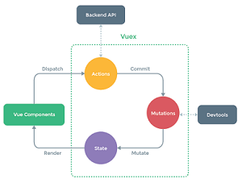

你好，我叫程新松，目前就职于东方财富南京研发中心，曾就职于苏宁数据云，百分点等公司。自己是一个喜欢折腾的工程师，致力于全栈开发。
目前技术栈：vue+vuex+ssr+jq+koa+thinkjs+nginx+redis+websocket+mysql+小程序等。

在东方财富南京研发中心，主要负责公司内部系统的前端研发，东方贷外围系统开发，前端框架技术选型，项目结构搭建，
与后端探讨技术实现方案，协助其他人员解决问题，攻坚项目中技术难点。
**逐渐理解**web应用的结构和数据传递流程，形成web开发性能优化和可维护组件高复用的意识。
以及根据模块功能特性对前端页面分块管理和优化。

在苏宁数据云，主要负责苏宁云商城系统前端开发，理解业务并采用合适的前端技术，根据设计图进行重构和页面美化，支持业务快速迭代，
优化渲染和制程node中间层开发。
**学会**Node框架thinkjs的使用，对客户端请求的分发，转发，过滤以及数据包装，可以最大化实现并发请求，

在百分点，主要负责根据设计图实现UI界面，分类整理系统UI组件并封装高复用UI组件，根据数据接口实现界面状态管理。
**学习**并掌握了UI组件的封装复用技巧，样式重构理念，形成编写可维护性代码的意识。

大学期间，以第一作者发表一篇国际会议5GWN论文，获得最佳论文奖。并且获得发明专利一项，已授权。

-- **自我介绍到这儿** --

##### 东方财富工作职责和内容
主要内容：南京团队基础技术支持，包含构建流程，新技术探索等，接入Vuex实现前端状态管理，全局路由控制，
约定前端开发规范，配置小组内静态资源服务器简单实现均衡负载，缓存策略，图片处理等。

逐渐理解web应用的结构和数据传递流程，形成web开发性能优化和可维护组件高复用的意识。
以及根据模块功能特性对前端页面分块管理和优化。

+ 协助人员解决问题？
小贷组在南京只有2个前端，我一个和另外一个是后端女生转的前端，她不会的我都会取协助解决，并且约定前端开发规范。

+ 攻坚项目中技术难点？
1、比如我们做了一个看板系统，在看板的详情页中，需要在不同泳道，不同列中都是可以随意拖拽的，
后端的数据接口：需要调用一个接口，把所有数据都一把给我，前端进行遍历和判断返回到页面。

拖拽是难点：
+ 1、涉及到vue的异步更新DOM问题；
+ 2、多个小组人员同时操作同一个卡片的问题；
+ 3、当泳道和列很多的时候，接口容易出现超时问题

最终经过技术讨论和分析：
+ vue的异步更新DOM问题使用Vue.nextTick()解决
+ 多个小组同时操作同一个卡片的问题，使用websocket实现数据双向通信，最后一个人释放卡片的位置为卡片最终位置。
+ 后端接口改造，一个接口变三个接口，查泳道，查列，查泳道和列下对应的卡片。

再一次优化
+ 之前是websocket告诉我数据是否变化，我请求接口。后来我们采用websocket直接返回变化的数据，减少http请求。

##### 苏宁数据云工作职责和内容

**遇到比较难的项目：**
在苏宁的时候做过一个比较难的项目。数据云要做一个品加商城，项目难点：TOC的场景，购物车和选商品环节操作业务复杂，浏览器兼容到IE10，时间紧。
最终前端的方案：
+ 考虑到TOC场景，以及浏览器兼容性，使用thinkjs3+jq+artTemplate做基础页面，
+ 考虑到购物车和选商品参数业务复杂，使用vue嵌入，双向数据绑定页面更流畅，
+ 考虑到高并发，将node的框架thinkjs作为中间层，路由转发，拦截，数据组装发给中台系统。

我收获到，根据不同的业务场景，node作为中间层是有必要的，IO操作是线程池做，计算任务是主线程做。
node优势就是把I/O操作放到主线程外，这样主线程才能腾出手处理更多的请求。node线程池基于libuv这个库，这个库提供跨平台，线程池，事件池，异步I/O等。

最终团队加班，项目快速实现了0-1，按时完成上线，最后拿了个季度优。

##### 汽车发动机预警系统中的神经网络问题？
+ 使用传感器对汽车发动机的运行状态的实时监控，从而预测发动机未来的运行状态。
+ 工具是matlab和spss，建立SOM自组织神经网络，概率神经网络PNN，Elman神经网络。
+ 拥有发明专利一项，专利已经授权，获得2017年5GWN国际会议论文最佳论文奖。

SOM自组织神经网络：主要是用来降维和分类的，提出没有实际意义的项，将30维度降到8项.

Elman神经网络：主要是用来做元数据的预测，一部分用来训练，一部分用来检验。

PNN概率神经网络：主要用来做映射，将不同种类的故障映射到10多项的维度上，形成一个自主判断的系统，判断不同的实例的发动机状态。

+ 项目难点及解决：
  + 数据的处理：数据的维度有40多项，数据量有10万左右。数据是参加比赛的时候拿到的脱敏数据，使用的是matlab和spss处理数据。
  + 一次性取数据量过大容易崩溃，分批次去取和计算。
  + 有时候会出现过渡拟合和过渡分散，不断的调试不同的参数。

##### 一、你觉得你做过的项目或者优化最有价值的是哪个？为什么？对业务帮助？优势什么？
+ 最有价值：watermark-dom水印插件，其实可以设置成隐水印。因为这个使用最广，而且苏宁的一些内部管理系统也是使用这个，有一种成就感。
+ 业务上帮助：主要是避免有些人拍照或者截图将一些管理系统敏感数据发到社交，这样谁泄露谁负责，而且可以设置成隐水印。
对比现有的方案：
+ qq音乐前端团队：他们使用canvas或者svg生成base64图片。
+ 阿里月饼知道隐水印，轻松还原截图：他们利用的是对RGB中最低位进行操作，
+ 优势：（1）简单易操作，配置容易，支持本地引用和npm引入。（2）避免截屏，拍照，都可以追回。（3）使用setInterval可以实现避免删除dom元素。

##### 二、你做的东西可以复用与其他团队吗？
因为这个watermark-dom使用起来很简单，支持本地引用，支持UMD，支持commonjs，支持es6，支持amd。

##### 三、需要监听那种频繁发生的事件，你有那些优化么？
+ 最基本方案：加定时器，延迟执行，实质是防抖，**任务触发的间隔超过指定间隔才执行**。但是现在也有一种防抖是立即执行，后续的触发的执行被清除
+ 节流，只允许一个函数在500ms内执行一次，**指定时间间隔，间隔内只会执行一次任务**。比如图片懒加载


##### 四、埋点的实现思路？
根据不同的需求采用不同的埋点方案。
+ 页面访问量：PV（人次），UV（人数）
+ 功能点击量

页面访问量，影响因素：内容，入口，页面位置，主页面深度。采集页面加载from，to获取用户的访问路径。

比如vue的单页面的时候，可以使用Router.beforeEach方法，也可以使用beforeRouterEnter和beforeRouterLeave。

如果是vue的多页面，封装公用的逻辑

如果是ssr应用，直接统计调用模板的次数就知道PV（人次）


##### 五、文件上传断点，续传？
上传大文件的时候，必须具备文件断点续传，不然用户体验会很差。

+ 传统的方法是使用formData文件整块的提交，服务端取到文件在转移，重命名。因此无法实时保存文件已上传的部分。

原因是：http协议下，浏览器无法与服务端长连接，不能以文件流的形式来提交。

方案：
+ 选择一个文件后，获取该文件在服务器上的大小，
+ 根据已上传文件大小切割文件，不断向服务器提交文件片，服务器不断追加文件内容。
+ 当上传文件大小达到文件总大小，上传结束。

+ 首先：文件分隔中，h5新增Blob数据类型，提供了分割数据方法slice，可以截取二进制文件的一部分。
+ 文件片保存和追加：后端使用node
+ 服务器端实时保存已上传文件大小，以便下次上传前准确切割


##### 六、vue的生命周期
**简单的说：**
- 如果你说：beforCreate，created，beforeMount，mounted，beforeUpdate，updated，beforeDestroy，destroyed，
这8个生命周期的钩子函数。创建->挂载->更新->摧毁。

###### 1、init各种初始化
首先，我们需要创建一个实例，也就是new Vue()的对象的过程中，首先执行init（init是vue组件中默认去执行的）

+ （1）首先生命周期（init lifeCycle）：初始化vm实例上的一些参数
+ （2）事件监听的初始化（init Events）
+ （3）模板解析变量的初始化（initRender）
+ （4）执行beforeCreate方法
+ （5）父组件初始化注入（initInjections）：数据初始化之前
+ （6）初始化数据（initState） vm上的prop/data/computed/method/watch状态在初始化。初始化initData方法
+ （7）子组件初始化注入（initProvide）：数据初始化之后
+ （8）执行created方法

- 不要在beforeCreate中去修改data，因为数据还没有初始化，所以最早也要在created中修改data。

- vue1.0使用documentFragment进行模板解析， vue2.0使用的是HTML Parser将模板解析成都直接执行的render函数，模板预编译是服务端SSR前提。

###### 2、beforeMount和mounted

+ （1）判断是否有el的option选项

created完成之后，会去判断实例（instance）是否包含el的option选项，
如果没有，就会调用**vm.$mount(el)**这个方法挂载模板，然后执行下一步，
如果有，直接执行下一步。

+ （2）判断是否有template选项

判断玩el的options选项之后，会去判断是否含有实例内部template选项
如果有，将实例内部template解析成一个render function（渲染函数），是template编译过程，结果是解析成render函数的字符串形式。
如果没有，将调用外部html。

+ （3）beforeMount钩子函数：将已经完成的html挂载到对应的虚拟DOM上，$el还只是我们html里面写的节点。

+ （4）虚拟DOM替换真实DOM：也就是将编译好的html替换el属性指向的DOM。编译过程是render function（渲染函数）

+ （5）mounted钩子函数：完成真实DOM的挂载，做一些异步请求数据，mounted在实例中只执行一次。

我们在写.vue开发中，写template模板，经过vue-loader处理之后，变成render function（渲染函数），
最终放到vue-loader解析过的文件里。为啥要这样做，因为解析template变成render function过程，
非常耗时，vue-loader帮我们提前做了，这样页面执行vue代码，效率会变得更好。

mounted挂载完毕，这个实例算走完流程了。

**疑问**：
+ 1、为什么el属性判断在判断template之前？因为el属性是一个选择器，vue实例需要用这个选择器el去template中寻找对应的。
+ 2、vue实例中有一种render选项
+ 3、渲染优先级：render函数 > template属性 > 外部html
+ 4、vue的编译过程：将template编译成render函数过程
+ beforeMount到mounted过程：vue实例的$el去代替渲染函数中html内的el属性

###### 3、数据变化，更新DOM
这个更新过程：数据变化-->导致虚拟DOM改变-->调用这个两个钩子改变视图

+ （1）监听数据变化
+ （2）beforeUpdate钩子函数：数据更新之前
+ （3）渲染新的虚拟DOM，拿新的虚拟DOM与之前虚拟DOM比较，使用diff算法，然后更新视图
+ （4）updated钩子函数：更新视图之后

**关键**：Object.defineProperty。一个普通的js对象传给vue实例的data，
vue将遍历此对象的所有属性，并且使用Object.defineProperty把这些属性全部
转换为getter/setter。

**vue的响应式原理设计三个重要对象：Observer，Watcher，Dep。**
+ Observer对象：vue中的数据对象在初始化过程中转换为Observer对象。
+ Watcher对象：将模板和Observer对象结合在一起生成Watcher实例，Watcher是订阅者中的订阅者。
+ Dep对象：Watcher对象和Observer对象之间纽带，每一个Observer都有一个Dep实例，用来存储订阅者Watcher。

###### 4、实例销毁
+ （1）beforeDestroy钩子函数：实例销毁之前
+ （2）拆除数据监听，子组件，事件监听
+ （3）destroyed钩子函数：实例销毁完成后

###### 5、不常用的生命周期钩子
+ activated：当组件激活的时候调用
+ deactivated：组件停用的时候调用
+ errorCaptured：vue2.5之后出现，捕获子孙组件错误被调用


##### 七、vue的响应式设计
**总结响应式原理**


+ 在生命周期的initState方法中将data，prop，method，computed，watch中的数据劫持，
通过observe方法与Object.defineProperty方法将相关对象转为换Observer对象。
+ 然后在initRender方法中解析模板，通过Watcher对象，Dep对象与观察者模式将模板中的
指令与对象的数据建立依赖关系，使用全局对象Dep.target实现依赖收集。
+ 当数据变化时，setter被调用，触发Object.defineProperty方法中的dep.notify方法，
遍历该数据依赖列表，执行器update方法通知Watcher进行视图更新。
+ vue是无法检测到对象属性的添加和删除，但是可以使用全局Vue.set方法（或vm.$set实例方法）。
+ vue无法检测利用索引设置数组，但是可以使用全局Vue.set方法（或vm.$set实例方法）。
+ 无法检测直接修改数组长度，但是可以使用splice

##### 八、为啥vue3.0之后要用proxy？
肯定是vue2.x里的检测机制不全，因为Object.defineProperty最大局限是只能针对单例属性做监听，
vue2.x中对data属性做了遍历和递归，为每一个属性设置getter和setter。

而proxy可以理解成，在目标对象之前设置一层拦截，外界对该对象的访问，都必须通过这层拦截，所以提供了一种机制，对外界的访问进行过滤和改写。
也就是说，proxy监听的一个对象，这个对象的所有操作都会监听，这就可以实现代理所有的属性。

Object.defineProperty具体局限：
+ 对属性的添加，删除的检测
+ 对数组基于下标的修改，对.length修改检测
+ 对Map，Set，WeakMap，weakSet的支持

proxy的特性：
+ 默认为惰性检测：2.x中任何响应式数据都会被检测，3.x中，只有初始化可见部分所用到的数据会检测
+ 更精准的变动通知：2.x中Vue.set会导致依赖的watch都会执行一次，3.x中，依赖这个具体属性watch函数会被通知。
+ 不可变检测对象：阻止对他修改包括嵌套属性，类似于vuex状态树。

proxy设计模式：
+ 单一职责原则：面向对象设计中鼓励将不同职责分布到细粒度的对象中，proxy对原对象的基础上进行功能的衍生而不影响原对象，符合松耦合高内聚的设计理念。
+ 开发-封闭原则：代理可以随时从程序中去掉，而不用对其他代码进行修改。

proxy代理模式的使用场景：
+ 缓存代理
+ 验证代理
+ 实现私有属性

使用proxy监听
```js
  var data = {
        sum: 0
    }
    var proxy = new Proxy(data, {
        get(target, property) {
            return target[property]
        },
        set(target, property, value) {
            target[property] += value
        }
    })
```


##### 九、vuex的理解
vue的开发复杂的应用的时候，经常会遇到多个组件共享一个状态，或者多个组件更新同一个状态。
代码少的时候，可以使用组件之间的通信去维护修改数据。
随着系统的庞大，代码变得很难维护，父组件通过props传递多层嵌套数据由于层级过深显得很脆弱，业务交错复杂，难以搞懂交错负责关系的数据传递关系。

将数据层和组件层抽离出来，把数据层放到全局形成单一的Store，组件变得更薄，专门用来数据展示和操作。
所有数据变更都必须经过全局Store进行，从而形成单向数据流，使数据变化变得可预测。

vuex是专门为vue框架设计的，对vue的状态管理的库，借鉴redux的基本思想，将共享数据抽离到全局，以一个单例存放，
同时利用vue的响应式机制来进行高效的状态管理和更新。



分析上图：
vuex实现的是一个单向的数据流，全局拥有一个State对象存放数据，所有的修改Satte操作必须通过Mutation进行，
Mutation同时提供订阅者模式供外部插件调用获取State数据的更新。所有的异步接口需要走Action，常见于调用后端
接口异步获取更新数据。

**总的来说:**vuex运行依赖于vue内部数据双向绑定机制，需要new一个vue对象实现响应式机制。


##### 十、js面向对象的理解和感悟？
###### 1、什么是面向对象，面向对象的特点及解释？
+ 定义：万物皆对象，任何事物都有自己的特征（属性）和动作（方法），面向对象就是使用对象，使用对象开发封装属性和方法。
+ 特点（特性）：
（1）抽象性：用对象描述数据，抽象对象的核心属性和方法。
（2）封装性：用对象将数据和功能组合在一起
（3）继承性：自己没有的但是别人有，拿过来就是集成，集成是实现代码复用的一种手段。

###### 2、继承方式有哪些？
js的继承通常指的是原型链的继承，通过指定原型，可以通过原型链继承原型的属性和方法。

###### 2.1 原型链继承
原理：父类的实例作为子类的原型
```js
function Father() {
  this.colors = ['red','blue','green'];
}

function Son() {};
Son.prototype = new Father();

var s1 = new Son();
s1.colors.push('black');
console.log(s1.colors); // 'red,blue,green,black'

var s2 = new Son();
console.log(s2.colors);  // 'red,blue,green,black'
```
缺点：
+ 1、引用类型值的原型，被所有的实例共享
+ 2、子类创建实例，不能向超类构造函数传递参数

###### 2.2 构造函数继承（经典继承）
原理：不使用原型，在子类型的构造函数中调用超类构造函数。
```js
function Father() {
  this.colors = ['red','blue','green'];
};
function Son() {
  Father.call(this); //继承Father，向父类型传递参数
};
var s1 = new Son();
s1.colors.push('black');
console.log(s1.colors); //'red,blue,green,black'

var s2 = new Son();
console.log(s2.colors); //'red,blue,green'
```
缺点：
+ 1、方法都定义在构造函数中，函数不可复用。

###### 2.3 组合继承（最常用继承）
原理：原型链继承+构造函数继承，通过原型链实现原型的属性和方法继承，通过构造函数实现实例化对象属性的继承。
```js
function Father(name) {
  this.name = name;
  this.colors = ['red','blue','green'];
};
Father.prototype.sayName = function() {
  console.log(this.name);
};

function Son(name, age) {
  Father.call(this, name);  //继承实例属性，第一次调用Father()
  this.age = age;
};
Son.prototype = new Father();  //继承父类方法，第二次调用Father()
Son.prototype.sayAge = function() {
  console.log(this.age);
};

var s1 = new Son('saucxs',18);
s1.colors.push('black');
console.log(s1.colors); // 'red,blue,green,black'
s1.sayName();  // saucxs
s1.sayAge();  // 18

var s2 = new Son('gmw', 15);
console.log(s2.colors); // 'red,blue,green'
s2.sayName(); //gmw
s2.sayAge(); // 15
```
缺点：
+ 1、调用了两次父类构造函数
+ 2、父类的实例属性和方法在子类的实例中，鱼仔子类的原型中。

###### 2.4 原型式继承
原理：直接将对象赋值给构造函数的原型。
```js
    /*object方法将传入的对象执行一次浅复制，将F的原型指向传入的对象*/
function objcetSame(obj) {
  function F() {};
  F.prototype = obj;
  return new F();
}

var person = {
    name: 'saucxs',
    friends: ['gmw', 'cc', 'cxs']
};

var p1 = objcetSame(person)
p1.name = 'SAUCXS';
p1.friends.push('ROB');
console.log(p1)  
// name: "SAUCXS"
// __proto__:
//    friends: (4) ["gmw", "cc", "cxs", "ROB"]
//    name: "saucxs"

var p2 = objcetSame(person);
p2.name = 'LINDA';
p2.friends.push("HEIHEI");
console.log(p2)  
// name: "LINDA"
// __proto__:
//    friends: (5) ["gmw", "cc", "cxs", "ROB", "HEIHEI"]
//    name: "saucxs"

console.log(person)  
// friends: (5) ["gmw", "cc", "cxs", "ROB", "HEIHEI"]
// name: "saucxs"
```
ES5中有Object.create()方法，替代上面objcetSame方法。

缺点：
+ 1、引用类型值的原型，被所有的实例共享
+ 2、子类创建实例时，无法向父类构造函数传递参数

###### 2.5 寄生式继承
原理：原型式继承基础上，增强对象，返回构造函数。
```js
function creatwAnother(original) {
  var clone = Object.create(original);  // ES5的创建一个新对象
  clone.sayName = function(name) {     // 增强这个对象
    console.log(name)
  };
  return clone;
};

var person = {
    name: 'saucxs',
    friends: ['gmw', 'cc', 'cxs']
};

var p1 = creatwAnother(person);
p1.sayName(person.name);
```
缺点：
+ 1、引用类型值的原型，被所有的实例共享
+ 2、子类创建实例时，无法向父类构造函数传递参数

###### 2.6 寄生式组合继承
原理：构造函数继承传递阐述+寄生式继承
```js
function inheritPrototype(S1, F1) {
  var prototype = Object.create(F1.prototype);   // 创建对象
  prototype.constructor = S1;                    // 增强对象
  S1.prototype = prototype;                      // 指定对象
};

// 父类初始化实例属性和方法
function Father(name) {
  this.name = name;
  this.colors = ['red', 'blue', 'green'];
};
Father.prototype.sayName = function() {
  console.log(this.name);
};

// 借用构造函数床底增强子类实例属性
function Son(name, age){
    Father.call(this, name);
    this.age = age;
};

// 父类原型指向子类
inheritPrototype(Son, Father);

// 新增子类原型属性
Son.prototype.sayAge = function() {
  console.log(this.age);
};

var s1 = new Son('saucxs', 18);
s1.colors.push('black');
console.log(s1);   
// age: 18
// colors: (4) ["red", "blue", "green", "black"]
// name: "saucxs"
// __proto__: Father


var s2 = new Son('gmw', 15);
s2.colors.push('orange');
console.log(s2);

// age: 15
// colors: (4) ["red", "blue", "green", "orange"]
// name: "gmw"
// __proto__: Father
```

库的实现方式


###### 2.7 ES6的类式继承
```js
// 长方形类
class Rectangle {
    /*constructor*/
    constructor(height,width){
        this.height = height;
        this.width = width;
    }
    
    /*getter*/
    get area() {
        return this.calcArea();
    }
    
    /*method*/
    calcArea(){
        return this.height * this.width;
    }
}

const rec = new Rectangle(10, 20);
console.log(rec.area);   //200

// 继承
class Square extends Rectangle {
    constructor(length){
        super(length, length);
         // 如果子类中存在构造函数，则需要在使用“this”之前首先调用 super()。
         this.name = 'Square';
    }
    
     get area() {
        return this.height * this.width;
      }
}
const square = new Square(10);
console.log(square.area);   // 100
```

####### 总结
因为有了面向对象编程，代码更加整洁，易维护，实现了代码的复用，
这也是前端开发中需要设计的高内聚，低耦合的原则。


##### 十一、浏览器输入 url 到页面的展现，发生了哪些事情？
###### 主干流程：
+ （1）从浏览器接收url --> 开启网络请求线程（涉及到：浏览器机制，线程和进程关系等）
+ （2）开启网络请求线程 --> 发出一个完整的http请求（涉及到：DNS查询，TCP/IP请求。5层网络协议栈）
+ （3）服务器接收请求 --> 对应后台接收到请求（涉及到：均衡负载，安全拦截，后台内部处理）
+ （4）后台和前台交互（涉及到http头，响应码，报文结构，cookie等，cookie优化，编码解码如gzip压缩等）
+ （5）缓存问题：http缓存（涉及到http缓存头部，etag，expired，cache-control等）
+ （6）浏览器接收http数据包 --> 解析流程（涉及到：html词法分析，构建dom树，同时解析css生成css规则树，合成render树。然后布局layout，painting渲染，符合图层合成，GPU绘制，外链接处理，loaded等）
+ （7）css可视化格式模型（涉及到：元素渲染规则，比如：块，控制框，BFC等）
+ （8）js引擎执行过程（涉及到：js解释阶段，预处理阶段，执行阶段生成执行上下文，VO全局对象，作用域链，回收机制等）
+ （9）其他（扩展其他模块：跨域，web安全等） 

细节的地方，参考这个：http://www.chengxinsong.cn/post/63

##### 十二、开发中性能优化的方案：
+ 1、网络性能优化：
    + (1)DNS预解析，预先获取域名对应的IP
    + (2)缓存：强缓存和协商缓存。
    + (3)强缓存：表示缓存期间不需要请求，通过响应头设置Expires和cache-control。
    + (4)协商缓存：如果缓存过期，我们需要使用协商缓存来解决问题，协商缓存需要请求，缓存有效返回304；协商缓存客户端和服务端共同实现；Etag和IF-None-Match，Etag类似
    指纹，有变动就将新资源返回。
    + (5)合适的缓存策略：大部分场景就可以使用强缓存配合协商缓存解决，还有特殊的缓存策略。比如不需要缓存的资源，使用cache-control：no-store。
    对于频繁变动的资源，cache-control：np-cache配合Etag使用，表示资源被缓存，但是每次都会发请求询问资源是都更新。
    + (6)使用htttp2.0：http1.1，每一个请求都需要建立和断开，消耗好几个RTT时间，并且由于TCP慢启动的原因，加载体积大的文件需要消耗更多时间。
    http2.0引入多路复用，能够让多个请求使用同一个TCP链接，极大的加快了网页的加载速度，支持header压缩，减少请求数据大小。
    + (7)预加载：比如有的资源不需要马上用，但是需要尽早获取，预加载其实是声明式的fetch，强制浏览器请求资源，并且不会阻塞onload事件。在link标签中使用rel属性preload。
    + (8)预渲染：将下载的文件预先在后台渲染，提高页面的加载速度。    
+ 2、渲染优化：
    + (1)懒执行：将某些逻辑延迟到使用时再计算。首屏优化，把耗时的逻辑不在首屏中使用，使用懒执行，一般通过定时器或者事件调用唤醒。
    + (2)懒加载：将不关键的资源延后加载。原理就是只加载自定义区域内需要加载的东西，比如常见图片懒加载和视频懒加载
+ 3、文件优化：
    + (1)图片大小优化：减少像素点和减少像素点能够显示的颜色
    + (2)图片加载优化：1、不用修饰类图片，使用css去代替。2、移动端图片，不用原图，用cdn加载，计算适配宽度，请求相应裁剪好的图片。3、小图使用base64格式。4、多个图标文件合并到一张图中。
    5、使用正确的图片格式，优先使用webp，小图使用png或者svg代替，照片使用jpg。
    + (3)其他文件优化：1、css放在head中。2、服务端开启文件压缩功能。3、script放在body底部，js执行会阻止渲染，价格defer会并行下载，但是不会执行，等到html解析完成后顺序执行，没有任何依赖的可以加async，表示渲染和js下载和执行并行进行。
    4、js代码过长会卡住渲染，可以考虑使用webworker,新开线程执行脚本不会影响渲染。    
     + (4)CDN：静态资源尽量使用CDN加载
+ 4、使用webpack优化项目：
    + webpack4，打包项目使用production模式，会自动开启代码压缩
    + 使用ES6的模块开启tree shaking，移除没有使用的代码
    + 优化图片，小图使用base64写入文件中
    + 按照路由拆分代码，实现按需加载
    + 给打包出来的文件名添加哈希，实现浏览器缓存文件

##### 十三、代码习惯
+ codeView：阅读别人代码，以别人代码为镜，更好提高自己，同时提醒自己如何写好代码让别人读。
+ 项目直觉：根据项目的需求这块，希望自己的东西得到认可，不是一味的去做，而是去思考，产品经理的这样设计的是否合理并且提出自己的解决方案。
+ 代码精致简单：过渡封装，黑盒子都是调试的杀手
+ 编码之前先设计一下思路再写

##### 十四、反问问题
+ 我比较在意自己的技术方向和职业发展，能够简单介绍下如果我面试上贵公司职位，我以后的工作内容和在团队的价值么？
+ 了解下公司对于前端的重视程度以及在大前端时代，团队对于技术的思考。

##### 十五、为啥换工作
+ 知道职业发展重要性，寻找更好更大的平台，将自己的能力发挥出来。


